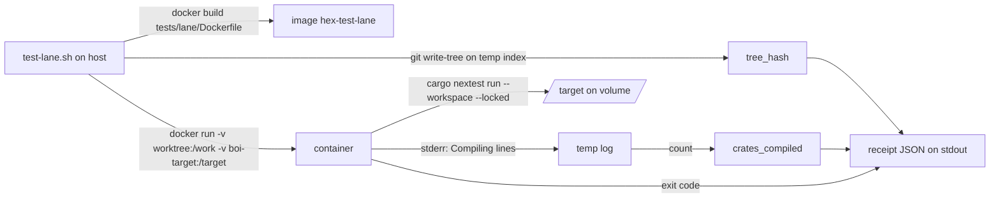
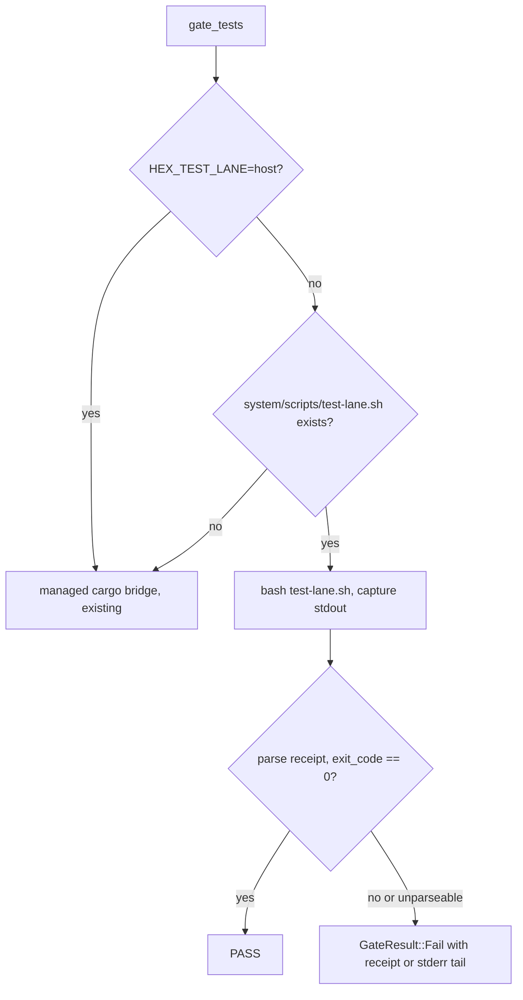

# feat: Container test lane and build cache guard

**Target repo:** hex-foundation. All paths below are relative to the repo root.

## Summary

Two foundation-owned items from the CTO testing posture plan, days 1 to 30.

1. A container test lane. `system/scripts/test-lane.sh` builds `tests/lane/Dockerfile`, mounts the current worktree at `/work`, mounts a named Docker volume `boi-target` at `/target` as the cargo target, runs `cargo nextest` inside, and prints one receipt JSON line to stdout. Because the source path and target path are the same for every worktree, cargo fingerprints match and compiled artifacts are reused across worktrees. The first user is the `tests` gate in `hex release cut`, which today runs `cargo test --workspace` on the host.
2. A guard worker `hex-build-cache-guard`. An hourly harness cron worker that prunes stale `.o` files from the BOI shared cargo target and fails loudly when `debug/deps` grows past a threshold.

Both ship in one PR against `develop`.

---

## Problem Frame

The BOI shared cargo target dir grew to 143,664 entries in `debug/deps`. Gatekeeper walks that directory on every test binary launch, so `syspolicyd` ran at 380% CPU. The instance fix (`~/.cargo/config.toml` with packed split-debuginfo) stops the growth, but nothing bounds the directory, and the 09-08 "fresh target" fix failed for exactly that reason.

Separately, every worktree compiles the workspace from scratch on the host. The release tests gate, BOI workers, and interactive sessions all pay the full cold compile because target paths differ per worktree. A container with a fixed path for source and target lets one set of artifacts serve every worktree.

---

## Requirements

Traceability: R1 to R7 come from the CTO plan section 7 row "Container lane script". R8 to R14 come from `build-cache-guard.spec.toml`.

| ID | Requirement |
|---|---|
| R1 | `tests/lane/Dockerfile` exists and is derived from `tests/core-e2e/Dockerfile` (cargo-chef stages, `rust:1.96` base). It contains a `cargo nextest` binary. |
| R2 | `system/scripts/test-lane.sh` runs from any hex-foundation worktree. It mounts the worktree at `/work` and the named volume `boi-target` at `/target`, and sets `CARGO_TARGET_DIR=/target` inside the container. |
| R3 | The lane runs `cargo nextest run --workspace --locked` inside the container. Extra arguments after `--` pass through to nextest. |
| R4 | The script prints exactly one receipt JSON object to stdout. Fields: `schema`, `tree_hash`, `command`, `exit_code`, `crates_compiled`, `duration_secs`, `image`, `volume`, `started_at`. All progress and cargo output goes to stderr. |
| R5 | The script exits with the nextest exit code. If Docker is missing or the daemon is not reachable, the script prints a clear message to stderr and exits 2 without a receipt. No quiet failures. |
| R6 | Acceptance: a second lane run with no source change reports `crates_compiled: 0`. |
| R7 | The `tests` gate in `hex release cut` runs the lane when `system/scripts/test-lane.sh` exists in the repo root, parses the receipt, and passes only when `exit_code` is 0. The gate keeps `GateKind::Tests`. `HEX_TEST_LANE=host` forces the existing managed cargo path. |
| R8 | New file `system/harness/src/modules/build_cache_guard.worker.rs`, auto-discovered by `build.rs`. Worker name `hex-build-cache-guard`, `pub const CRON_HOURLY: &str = "0 15 * * * * *"`. |
| R9 | The handler reads `cargo_target_dir` from `~/.boi/v2/daemon.toml`. Missing file or key logs one warning and returns Ok. |
| R10 | In `<target>/debug/deps`, delete regular files whose name ends in `.o` and whose mtime is older than 60 minutes. Never touch younger files or non-`.o` files. |
| R11 | Count remaining entries. Above `pub const DEPS_ENTRY_THRESHOLD: usize = 25_000`, return Err with the directory, the count, and the threshold in the message. |
| R12 | Log one summary line per run: deleted count and remaining entries. A missing `debug/deps` dir returns Ok with one log line. |
| R13 | `system/harness/tests/workers_registry_test.rs` asserts `hex-build-cache-guard` is registered with exactly one cron trigger equal to `CRON_HOURLY`. |
| R14 | Unit tests against a tempdir cover: stale `.o` deleted, fresh `.o` kept, non-`.o` kept, threshold Err carries the count and names the threshold constant. |

### Success criteria

- `cargo build` and `cargo test -p hex-harness` pass on the host.
- The lane image builds. Run 1 compiles N crates and passes. Run 2 reports 0 crates compiled and passes. Both receipts are recorded in the PR description.
- `hex release cut` on a foundation worktree routes the tests gate through the lane.

---

## Scope Boundaries

### In scope

Everything in R1 to R14. A short section in `docs/testing.md` on how to run the lane.

### Out of scope (this PR)

- BOI repo items from section 7: spec lint, build broker, `[contract].runner = "container"`, receipts in `boi.db`. BOI is read-only from hex.
- personal-instance items: spec template rewrite, worktree prune, cache delete, canary spec, `daemon.toml` changes.
- Days 31 to 90 foundation items: host lane trigger, nightly harness worker in the lane, `nextest.toml` retries and quarantine, metrics table, `hex test stats`.
- Changing the CI workflows. `ci.yml` keeps `cargo test --workspace` on the GitHub runner.

### Deferred to Follow-Up Work

- Seed the `boi-target` volume from the image's cooked deps so the first lane run is warm. This plan cooks deps into `/target` in the image, which Docker copies into a fresh named volume on first mount. Verify the hit rate at implementation. The acceptance criterion (R6) does not depend on it.
- Mount the main repo's git common dir into the container so `build.rs` resolves a real `HEX_GIT_SHA`. Without it the lane binary reports `unknown`. No test asserts on the value today. Revisit if a test starts to.
- A `hex test lane` subcommand wrapping the script.

---

## Key Technical Decisions

**KTD1. The lane stays a shell script plus a Dockerfile, not a Rust subcommand.** The CTO plan names `system/scripts/test-lane.sh` as the deliverable. The release gate calls it through `bash`. A Rust wrapper is a follow-up. Governs R2 to R5.

**KTD2. Fixed paths `/work` and `/target`.** Cargo fingerprints include the source path and the target path. Mounting every worktree at `/work` and the same volume at `/target` makes artifacts identical across worktrees. This is the whole reason the lane exists. Governs R2, R6.

**KTD3. The image cooks dependencies into `/target` with cargo-chef, using the test profile.** Copied from the core-e2e Dockerfile shape. The planner stage copies the workspace manifests and both member crates so `cargo chef prepare` sees the path dependency `system/harness -> ../code-intel`. The cook stage runs with `CARGO_TARGET_DIR=/target` and `--tests`. Docker copies image content at a mount point into a new named volume, so the first lane run can start warm. Governs R1.

**KTD4. Receipt goes to stdout, everything else to stderr.** The release gate captures stdout and parses one JSON object. Cargo and nextest output stream to stderr so the operator sees progress during a 10 minute run. Governs R4, R7.

**KTD5. `crates_compiled` counts cargo `Compiling` lines.** Cargo prints one `   Compiling <crate> v<ver>` line per crate it builds. The script tees the container's stderr to a temp log and counts lines matching `^\s*Compiling `. Zero lines on run 2 is the acceptance signal. Governs R4, R6.

**KTD6. Tree hash is computed on the host from a temporary index.** The script builds a temp `GIT_INDEX_FILE`, runs `git add -A` into it, and takes `git write-tree`. This hashes the working tree including uncommitted changes, without touching the real index. It does not depend on git inside the container. Governs R4.

**KTD7. The release gate prefers the lane when the script exists, and the host path stays as a documented escape hatch.** `gate_tests` checks for `system/scripts/test-lane.sh` under the repo root. Present: run the lane. Absent, or `HEX_TEST_LANE=host`: run the existing managed cargo bridge path. The gate prints which path it chose. A lane failure (including missing Docker) is a gate failure, never a silent fallback. The pinned test `builtin_foundation_battery_is_the_pinned_six` still holds because the gate kind stays `Tests`. Governs R7.

**KTD8. Guard worker logic is typed Rust with the `toml` crate already in the tree.** `toml = "0.8"` is a harness dependency. Parse `daemon.toml` into a `toml::Value` and read the string key. The prune and count function takes a directory and a `now` timestamp so tests control time. Governs R9 to R12.

**KTD9. Threshold breach is `anyhow::bail!`, not a bespoke notifier.** The harness failure path turns Err into telemetry and an alert. The worker returns Err with the directory, count, and threshold. Governs R11.

**KTD10. Test mtimes use `File::set_modified`.** Stable std since Rust 1.75. No `filetime` dependency. Governs R14.

---

## High-Level Technical Design

Lane data flow, one run:



Release gate routing:



Guard worker, one tick:

```text
read ~/.boi/v2/daemon.toml -> cargo_target_dir   (missing: warn, Ok)
deps = <target>/debug/deps                          (missing: log, Ok)
for entry in deps: regular file, name ends ".o", mtime older than 60 min -> delete
remaining = count(entries in deps)
log "deleted=<n> remaining=<m> threshold=25000 dir=<deps>"
remaining > DEPS_ENTRY_THRESHOLD -> Err(...)  else Ok
```

---

## Output Structure

```text
tests/lane/Dockerfile                                   new
system/scripts/test-lane.sh                             new, executable
system/harness/src/modules/build_cache_guard.worker.rs  new
system/harness/src/release.rs                           modified (gate_tests routing, receipt parsing, tests)
system/harness/tests/workers_registry_test.rs           modified (one new test)
docs/testing.md                                         modified (lane section)
docs/plans/2026-09-14-1546-feat-container-test-lane-build-cache-guard-plan.md  this file
```

---

## Implementation Units

### U1. Lane image

**Goal:** A Docker image with the Rust toolchain, cargo-nextest, and cooked workspace dependencies at `/target`.

**Requirements:** R1, KTD3.

**Dependencies:** none.

**Files:**
- `tests/lane/Dockerfile` (create)

**Approach:**
1. Stage `chef`: `FROM rust:1.96`, install `pkg-config git`, `cargo install cargo-chef --locked`. Same as core-e2e.
2. Stage `planner`: `WORKDIR /work`. Preserve the repo layout under `/work`. Do not flatten like core-e2e does (core-e2e copies the harness to `/build` and code-intel to `/code-intel`, and never copies the root manifests; that layout cannot build the workspace and would not match the mounted worktree). Literal copy lines:
   - `COPY Cargo.toml Cargo.lock ./`
   - `COPY system/harness/ system/harness/`
   - `COPY system/code-intel/ system/code-intel/`
   - `COPY system/managed_cargo_bridge.rs system/managed_cargo_bridge.rs` (`lib.rs` includes it by `#[path = "../../managed_cargo_bridge.rs"]`)
   - `COPY system/scripts/managed-cargo-gate.py system/scripts/managed-target-check.py system/scripts/`
   Then `RUN cargo chef prepare --recipe-path recipe.json`.
3. Stage `lane` (final): from `chef`. `WORKDIR /work`. `COPY --from=planner /work/recipe.json recipe.json`, then the same five copy lines. `ENV CARGO_TARGET_DIR=/target`. Run `cargo chef cook --recipe-path recipe.json --workspace --tests`. Check `cargo chef cook --help` first; if `--tests` or `--workspace` is not accepted by the installed cargo-chef, drop the flag and note it in the PR. Install nextest from the prebuilt tarball into `/usr/local/cargo/bin`. Pick the URL by `uname -m`: `https://get.nexte.st/latest/linux-arm` on `aarch64` (this Mac runs arm64 containers under OrbStack), `https://get.nexte.st/latest/linux` on `x86_64`. Verified at plan time: the URLs redirect to the 0.9.144 release tarballs. Run `git config --global --add safe.directory '*'` so a mounted worktree does not trip the dubious-ownership check. Remove the copied source under `/work` so the mount is the only source. No `ENTRYPOINT`; the script passes the command.
4. Keep the comment block from core-e2e explaining the chef cache, rewritten in plain language for the lane.

**Patterns to follow:** `tests/core-e2e/Dockerfile` for the chef stage, the comment style, and the cook-then-copy order only. Its copy destinations are wrong for this image; use the literal lines above.

**Test scenarios:**
- Test expectation: none. This is packaging. U2 verifies the image by running the lane twice.

**Verification:** `docker build -f tests/lane/Dockerfile -t hex-test-lane .` completes. `docker run --rm hex-test-lane cargo nextest --version` prints a version.

---

### U2. Lane script

**Goal:** `system/scripts/test-lane.sh` runs the workspace tests in the lane image and prints a receipt.

**Requirements:** R2 to R6, KTD1, KTD2, KTD4, KTD5, KTD6.

**Dependencies:** U1.

**Files:**
- `system/scripts/test-lane.sh` (create, `chmod +x`)

**Approach:**
1. `set -euo pipefail`. Resolve the repo root with `git rev-parse --show-toplevel`. Refuse to run outside a git worktree.
2. Preconditions, loud: find `docker` on PATH, then `/usr/local/bin/docker`, then `/opt/homebrew/bin/docker`. Run `docker info` once. Any failure: message to stderr naming what is missing and that OrbStack must be running, exit 2.
3. Defaults from env with overrides: `TEST_LANE_IMAGE=hex-test-lane`, `TEST_LANE_VOLUME=boi-target`. Flags: `--no-build` skips the image build (exit 2 with a message naming the image if it is absent), `--` separates nextest args.
4. Build the image with `docker build -f tests/lane/Dockerfile -t "$IMAGE" .` from the repo root. Output to stderr. `.dockerignore` already excludes `target/` and `.git/`.
5. Compute `tree_hash` per KTD6.
6. Record `started_at` (UTC ISO 8601) and a start timestamp.
7. Run the container: `docker run --rm -v "$root:/work" -v "$VOLUME:/target" -e CARGO_TARGET_DIR=/target -w /work "$IMAGE" cargo nextest run --workspace --locked "$@"`. No `-t` flag.
8. Send the container's combined output (`2>&1`) through `tee "$log"` and on to stderr (`>&2`). Read the container exit code from `${PIPESTATUS[0]}` right after the pipeline, not from `$?`, which would be `tee`'s status.
9. `crates_compiled` = count of lines in the temp log matching `^[[:space:]]*Compiling `.
10. Print one JSON object to stdout with the fields in R4. Build it with `printf` and escape the command string; no `jq` dependency.
11. Exit with the container exit code.

**Execution note:** Smoke-first. Run the script twice against the current worktree and keep both receipts for the PR description. The second receipt must show `crates_compiled: 0`.

**Patterns to follow:** `system/scripts/hex-integration-check.sh` for shell style. Verify-gate rules in the hex instance `CLAUDE.md` (preserve exit codes, never pipe through `tail` before checking status).

**Test scenarios:**
- Success path: run 1 on a clean worktree exits 0 and the receipt has `crates_compiled` greater than 0.
- Success path: run 2 with no change exits 0 and the receipt has `crates_compiled: 0` and the same `tree_hash`.
- Edge: a one-line edit to a harness source file changes `tree_hash` and makes `crates_compiled` small and nonzero.
- Error: `PATH` without docker and no docker at the two known paths prints a message naming docker and exits 2 with no stdout.
- Error: `--no-build` with no image present exits 2 with a message naming the image and no stdout.
- Negative: the `Compiling` count ignores lines such as `Finished`, `Running`, and nextest's own summary lines. Check against a saved log from run 2.
- Pass-through: `-- --no-run` produces a receipt with `exit_code: 0` and runs no tests.
- `bash -n system/scripts/test-lane.sh` passes. If `shellcheck` is on the host, it passes at default severity.

**Verification:** Both receipts recorded. Script is executable and fmt-clean for shell (consistent 2 or 4 space indent).

---

### U3. Release gate routes through the lane

**Goal:** `hex release cut` runs the `tests` gate in the container lane when the lane script exists.

**Requirements:** R7, KTD4, KTD7.

**Dependencies:** U2.

**Files:**
- `system/harness/src/release.rs` (modify: `gate_tests`, new `lane_receipt` parsing, new tests in the existing `mod tests`)

**Approach:**
1. Add a small `LaneReceipt` struct deriving `serde::Deserialize` with `exit_code: i32`, `crates_compiled: u64`, `duration_secs: f64`, `tree_hash: String`. Unknown fields ignored.
2. Add `fn tests_gate_route(repo_root, env_override) -> TestsRoute` returning `Lane(path)` or `Host`. Pure, so it is unit testable. `HEX_TEST_LANE=host` wins. Otherwise `Lane` when `repo_root/system/scripts/test-lane.sh` is a file.
3. In `gate_tests`, print the chosen route. For `Lane`: spawn `bash <script>` with `current_dir(repo_root)`, `stdout` piped, `stderr` inherited so the operator sees progress, `stdin` null. Wait, read stdout, then call `lane_gate_result(exit_status, stdout)`.
4. `fn lane_gate_result(code: Option<i32>, stdout: &str) -> GateResult`, pure. Rules: no exit code means signal, Fail. Exit 2 with empty stdout means precondition failure, Fail with "test lane could not start; see stderr". Parse the last non-empty stdout line as `LaneReceipt`. Parse error is Fail with the raw tail. `exit_code == 0` is Pass and the gate prints `crates_compiled` and `duration_secs`. Anything else is Fail naming the exit code and tree hash.
5. Update the `GateKind::Tests` doc comment and the `gate_tests` doc comment to describe the lane route and the host escape hatch. Keep the `cargo test --workspace` messages on the host route unchanged so the existing tests at `gate_tests_result` still pass.

**Patterns to follow:** `gate_tests_result` for the loud-failure message shape. `docker_suite` for how a long container run reports.

**Test scenarios:**
- `tests_gate_route` returns `Host` when the env override is `host`, even when the script exists.
- `tests_gate_route` returns `Host` when the script file is absent.
- `tests_gate_route` returns `Lane` when the script exists and there is no override.
- `lane_gate_result(Some(0), <receipt with exit_code 0>)` is Pass.
- `lane_gate_result(Some(1), <receipt with exit_code 1, crates 3>)` is Fail and the message contains `exit 1`.
- `lane_gate_result(Some(2), "")` is Fail and the message says the lane could not start.
- `lane_gate_result(Some(0), "not json")` is Fail and the message contains the raw text.
- `lane_gate_result(None, ...)` is Fail and names a signal.
- Existing `builtin_foundation_battery_is_the_pinned_six` still passes unchanged.

**Verification:** `cargo test -p hex-harness release::` green. A dry check on the worktree: `hex release cut` is not run (releases are agent-owned), but `gate_tests` is exercised through the unit tests above and the route print is visible in a manual `cargo run -- release` help path only if cheap. Do not run a real release.

---

### U4. Build cache guard worker

**Goal:** Hourly worker that prunes stale `.o` files in the BOI cargo target and fails loud above the threshold.

**Requirements:** R8 to R12, R14, KTD8, KTD9, KTD10.

**Dependencies:** none. Can run in parallel with U1 to U3.

**Files:**
- `system/harness/src/modules/build_cache_guard.worker.rs` (create; unit tests in a `#[cfg(test)]` module in the same file)

**Approach:**
1. Module doc comment in the `backup_offsite.worker.rs` style: what, why (syspolicyd incident, 143,664 entries), cadence, and the loud-failure contract.
2. Constants: `CRON_HOURLY = "0 15 * * * * *"`, `DEPS_ENTRY_THRESHOLD: usize = 25_000`, `STALE_AFTER = Duration::from_secs(60 * 60)`.
3. `pub fn daemon_toml_path() -> Option<PathBuf>` from `dirs::home_dir()` joined with `.boi/v2/daemon.toml`.
4. `pub fn read_cargo_target_dir(path: &Path) -> Result<Option<PathBuf>>`. Missing file: `Ok(None)`. Parse with `toml::from_str::<toml::Value>`; missing or non-string key: `Ok(None)`. Parse error: Err (a corrupt daemon.toml is loud).
5. `pub struct GuardSummary { deleted: usize, remaining: usize, deps_dir: PathBuf }`.
6. `pub fn prune_and_count(deps_dir: &Path, now: SystemTime) -> Result<Option<GuardSummary>>`. Missing dir: `Ok(None)`. Iterate `read_dir`. For each entry: `file_type().is_file()`, name ends with `.o`, `metadata().modified()` older than `STALE_AFTER` relative to `now`: `remove_file`. Count every entry that remains after the pass. Never recurse. Never follow symlinks.
7. `pub fn check_threshold(summary: &GuardSummary) -> Result<()>`. `bail!` when `remaining > DEPS_ENTRY_THRESHOLD` with dir, count, and threshold in the message.
8. `pub fn run_guard_at(daemon_toml: &Path, now: SystemTime) -> Result<Option<GuardSummary>>`: read target dir, `eprintln!` one warning and return Ok(None) on `None`; call `prune_and_count` on `<target>/debug/deps`; log one summary line with the `[build-cache-guard]` prefix; then `check_threshold`. Handler `run_guard(_e: Event, _ctx: Ctx) -> Result<()>` resolves `daemon_toml_path()` and calls `run_guard_at` with `SystemTime::now()`.
9. `pub fn worker() -> Worker { Worker::new("hex-build-cache-guard").on_cron_named("hourly", CRON_HOURLY, run_guard) }`.

**Execution note:** Test-first for `prune_and_count` and `check_threshold`; the handler is thin glue.

**Patterns to follow:** `backup_offsite.worker.rs` and `freshness.worker.rs` for shape. `climber_digest.worker.rs` for `eprintln!` logging with a bracketed prefix. `tempfile` is already a dependency.

**Test scenarios:**
- Stale `.o` deleted: a `.o` file with mtime now minus 2 hours is removed; `deleted == 1`.
- Fresh `.o` kept: a `.o` file with mtime now minus 10 minutes remains; `deleted == 0`.
- Non-`.o` kept: a stale `.rlib` and a stale `.d` remain regardless of age.
- Subdirectory kept: a stale directory named `x.o` is not removed and counts as one entry.
- Missing deps dir returns `Ok(None)`.
- `remaining` equals the entry count after pruning.
- `check_threshold` with `remaining == DEPS_ENTRY_THRESHOLD` is Ok.
- `check_threshold` with `remaining == DEPS_ENTRY_THRESHOLD + 1` is Err and the message contains the count, the directory, and `DEPS_ENTRY_THRESHOLD.to_string()`.
- Handler path: `run_guard_at(daemon_toml: &Path, now)` (the handler minus `Event`/`Ctx`) with a missing daemon.toml returns Ok; with a daemon.toml whose target has no `debug/deps` returns Ok; with a populated deps dir returns the summary. `run_guard` calls this with the real path.
- `read_cargo_target_dir` on a missing file is `Ok(None)`; on a file with the key returns the path; on a file without the key is `Ok(None)`; on invalid TOML is Err.

**Verification:** `cargo test -p hex-harness build_cache_guard` green. `cargo fmt` clean on this file.

---

### U5. Registry test

**Goal:** The registry test pins the worker name and cron.

**Requirements:** R13.

**Dependencies:** U4.

**Files:**
- `system/harness/tests/workers_registry_test.rs` (modify: add one test)

**Approach:** Add `workers_registry_build_cache_guard_hourly_at_15` using the existing `cron_exprs` helper. Assert the worker exists, `cron_exprs` has length 1, and the single expression equals `hex::workers::hex_modules::build_cache_guard::CRON_HOURLY`. Add a short comment on why hourly at :15 (offset from the :00 memory tick).

**Test scenarios:**
- The new test passes against the registry.
- The full `workers_registry_test` file passes.

**Verification:** `cargo test -p hex-harness --test workers_registry_test` green.

---

### U6. Docs

**Goal:** Operators know how to run the lane and what the guard does.

**Requirements:** R2, R4, R8.

**Dependencies:** U2, U4.

**Files:**
- `docs/testing.md` (modify: add a "Container test lane" section after "Core E2E suite")

**Approach:** One short section: what the lane is, the two mounts, the receipt fields, the two commands (`bash system/scripts/test-lane.sh`, `bash system/scripts/test-lane.sh -- -p hex-harness`), the `HEX_TEST_LANE=host` escape hatch for `hex release cut`, and one line on `hex-build-cache-guard`. Plain language, short sentences, no em dashes.

**Test scenarios:**
- Test expectation: none. Documentation only.

**Verification:** Section renders and links resolve.

---

## Verification Contract

Run on the host from the worktree with `PATH` including `/opt/homebrew/bin`.

| Gate | Command | Pass condition |
|---|---|---|
| Build | `cargo build` | exit 0 |
| Harness tests | `cargo test -p hex-harness` | exit 0 |
| Registry test | `cargo test -p hex-harness --test workers_registry_test` | exit 0 |
| New files fmt | `rustfmt --check system/harness/src/modules/build_cache_guard.worker.rs` | exit 0 |
| Script syntax | `bash -n system/scripts/test-lane.sh` | exit 0 |
| Lane run 1 | `bash system/scripts/test-lane.sh` | exit 0, receipt printed |
| Lane run 2 | `bash system/scripts/test-lane.sh --no-build` | exit 0, `crates_compiled: 0` |
| Lane without Docker | `PATH=/usr/bin:/bin bash system/scripts/test-lane.sh` with the two known docker paths absent or shadowed | exit 2, message on stderr, nothing on stdout |

Do not gate on `cargo fmt --check` or `cargo clippy -D warnings` for the whole repo. Both are red on `develop` before this change.

---

## Definition of Done

- All six units landed on `feature/container-test-lane-build-cache-guard`.
- Verification Contract gates green, with both lane receipts pasted in the PR description.
- PR open against `develop` with the required attribution footer.
- CI `ci.yml` green or, if red, the failure is pre-existing and named in the PR.

---

## Assumptions

- OrbStack is running and `docker info` succeeds on this machine. Verified at plan time: server 29.4.0, 12 CPU, 15.7 GB.
- `rust:1.96` can read the root `Cargo.lock` written by cargo 1.97. Lock format v4 is supported since 1.78.
- The nextest prebuilt tarball URL is stable. If the download fails, fall back to `cargo install cargo-nextest --locked` in the same stage.
- No test asserts on `HEX_GIT_SHA` having a real value. Verified by grep at plan time: two `env!` reads, no assertions.
- The deps dir is at 22,498 entries at plan time, under the 25,000 threshold and above half of it. The spec's dispatch-time check ("below half the threshold, else STOP") was written for the old unpacked layout. The host `~/.cargo/config.toml` now packs debuginfo, so the first hourly prune drops the count. Proceed, and note the current count in the PR.

---

## Risks

| Risk | Mitigation |
|---|---|
| Cold image build plus first lane run takes 20 minutes or more. | Expected. Run once, record receipts. The chef cook layer caches for later image builds. |
| Volume seeding from image content does not make run 1 warm. | Not required for acceptance. Deferred item. |
| Container runs as root and writes into `/work`. | `--locked` prevents `Cargo.lock` writes. Target is on the volume. If any root-owned file appears in the worktree, add `--user $(id -u):$(id -g)` and note it. |
| `build.rs` runs `git status` inside the container where `.git` is a worktree pointer to a host path. | `build.rs` warns and continues with `unknown`. Deferred item covers mounting the common dir. |
| The `Compiling` line count includes build script compiles. | Acceptable. The acceptance criterion is zero on run 2. |
| The release gate change breaks the pinned battery test. | Gate kind stays `Tests`. Only `gate_tests` internals change. |
| Guard deletes a `.o` file a live link step still needs. | 60 minute age floor. Cargo link steps finish in seconds. |

---

## Follow-Ups (not this PR)

From section 7, owned elsewhere:

- BOI: spec lint for `--workspace` at task level; build broker; `[contract].runner = "container"`; receipts in `boi.db`; nextest archive reuse in `merge_to_integration`.
- Instance: rewrite open spec templates for per-task cargo scoping; prune the 96 worktrees; delete the 34 GB and 216 GB caches; weekly canary spec; point `daemon.toml` at a small host target.
- Foundation, days 31 to 90: host lane trigger from the `ci.yml` path filter; nightly lane worker; `nextest.toml` retries and quarantine; metrics in `events.db`; `hex test stats`.
