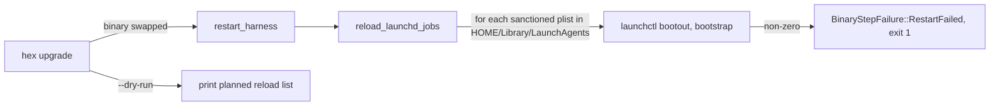

# feat: Testing standard follow-ups

**Target repo:** hex-foundation, branch `feature/testing-standard-followups` off `origin/develop` `5da21bc5`, worktree `~/worktrees/github.com/mrap/hex-foundation/testing-standard-followups`. PR against `develop`.

## Summary

Ship the testing standard into the repo, fix the drift the audit found in `docs/testing.md` and `test-cli.sh`, delete or merge the nine grep-shaped and tautological test binaries the audit named, add the three highest-value missing tests at the CLI and worker boundary (upgrade reloads every sanctioned launchd job, doctor flags files over 256 MB, a nightly test worker), and add the standard's verification-scope rule to the `boi-delegation` skill.

## Problem Frame

The audit (`$HEX_DIR/projects/hex-ops/audits/test-audit-2026-09-14.md`) found the suite "enough in volume, wrong in shape": 9 of 35 harness integration binaries hold 3 or fewer tests, 8 tests grep `src/` or `docs/` text, `docs/testing.md` names 5 files that do not exist, and `test-cli.sh` asserts the absence of 9 subcommands that were removed long ago. Two recent incidents (`hex-launch-2026-09-09`, `git-cpu-codex-snapshot-2026-09-09`) had no guarding test and still do not. Nothing runs the 12 `#[ignore]` tests on a schedule. The standard that fixes this lives only in the instance repo and is not linked from the foundation docs.

## Requirements

- R1. `docs/testing-standard.md` exists in the repo with the standard's text verbatim, with instance paths rewritten as `$HEX_DIR/...` per `docs/conventions.md`. `docs/testing.md`, `CLAUDE.md`, and `README.md` each link it in one line.
- R2. `docs/testing.md` names only files that exist. `test-cli.sh` no longer asserts on the 9 dead subcommand names.
- R3. The audit's top 10 deletion and merge list is applied where its reason holds on reading the file. Items 1 through 8 and 10 land in U3; item 9 (cron snapshot tests) lands in U6. Each kept test is named in the PR with the reason.
- R4. `hex upgrade` reloads every sanctioned launchd job it does not already restart, including `com.hex.failures-probe`, after a binary swap. A test runs `hex upgrade --dry-run` against a temp `HEX_DIR` and a fixture `LaunchAgents` dir and asserts the listed jobs. The failing test cites incident `hex-launch-2026-09-09`.
- R5. `hex doctor run` exits 1 and names the file when an unignored file over 256 MB sits in the workspace. A test runs the real subcommand against a temp `HEX_DIR` git fixture. The failing test cites incident `git-cpu-codex-snapshot-2026-09-09`.
- R6. A harness `.on_cron` worker `hex-nightly-tests` runs `system/scripts/test-lane.sh` with `--run-ignored all` and returns `Err` on a non-zero exit. `workers_registry_test.rs` asserts registration and the cron trigger.
- R7. `system/skills/boi-delegation/SKILL.md` has one short section with the verification-scope rule and two examples (bad, good).
- R8. No new crate dependencies. New files are `rustfmt` clean. Plain language, no em dashes, in every doc and the PR.

## Scope Boundaries

In scope: the items above, in hex-foundation only.

Out of scope, not deferred: instance edits in the personal instance (the instance copy of the standard stays as is and points at the foundation file by a later `/hex-upgrade`).

Why one PR: every unit traces to the same audit and Mike asked for the follow-ups as one changeset. The units declare no dependencies on each other so they can be reviewed and reverted commit by commit inside that one PR.

### Deferred to Follow-Up Work

- `.config/nextest.toml` (retries, slow-timeout, `--no-tests=fail` default). The standard calls for it; this PR does not add it.
- Passing model and network keys into the lane container so the `#[ignore]` model tests can pass under `--run-ignored all`. Until then the nightly worker reports those tests red. Recorded in the PR.
- Moving repo-structure lints (`shellout_paths.rs`, `arch_docs_registry.rs`) into a `hex lint-gates` host. `hex lint-gates` today lints BOI spec commands, not repo structure. This PR merges the two files into one binary instead (audit item 10, partial).
- Missing tests 3 through 10 from the audit's section 3 (consolidate full, hooks via stdin, worker fixture runs, `hex failures`, release cut gate, help-per-subcommand, recall authority).

## Assumptions

- A1. The sanctioned launchd list for `hex upgrade` is the labels the foundation ships plists for under `system/templates/launchd/` other than the harness itself: `com.hex.failures-probe`, `com.hex.scipd`, `com.hex.hitl-nudge`. `com.hex.harness` and `com.hex.harness-watchdog` stay with `restart_and_verify`. Instance-declared jobs (`com.mrap.*`, `com.hex.session-sentinel`) are not the foundation's to reload.
- A2. A job is reloaded only when its plist exists under `$HOME/Library/LaunchAgents/`. Absent plist means not installed on this box, nothing to do.
- A3. Reload means `daemon_green::native().stop(label)` then `.start(label)`, the same primitive `harness::supervise` uses for the harness. `stop` is a `bootout` that treats "not loaded" as success; `start` runs `bootstrap_robust` (waits for the async bootout to finish, retries, `asuser` fallback) then `kickstart -k`. `daemon_green` calls `launchctl` by name and derives the plist from `$HOME/Library/LaunchAgents/<label>.plist`, so a spy `launchctl` on `PATH` with a fixture `HOME` can observe the calls. This is the bootout plus bootstrap the incident receipt performed by hand, without the race a hand-rolled pair reintroduces.
- A8. The nightly worker needs the Docker daemon (OrbStack) reachable at cron time. When it is not, `test-lane.sh` exits 2 with a reason and the worker returns `Err`; that night has no test signal but the failure is loud in `events.db` and `hex failures`. The lane's `docker build` is layer-cached, so a healthy run does not rebuild the image; `--no-build` is not passed because it makes the lane refuse to run when the image is absent.
- A4. The nightly worker resolves the repo to test from `$HEX_DIR/.hex/config/nightly-tests.toml` (`repo = "<path>"`), falling back to `$HEX_DIR/.hex/.upgrade-cache` (the upgrade clone) when the file is absent. A missing repo path is `Err`, loud.
- A5. The nightly cron is `0 0 10 * * * *` (10:00 UTC, 03:00 PT), clear of the 03:00 UTC full consolidation and the 04:00 UTC backup.
- A6. `hex doctor` reads `git ls-files -z --cached --others --exclude-standard` to enumerate unignored paths. A `HEX_DIR` that is not a git repo yields `Skip`. Threshold is 256 MiB, matching the incident's fix item 4.
- A7. The `--max` help tests from `throttle_max_flag.rs` move to the new `memory_cli.rs` rather than `harness_cli_test.rs` as the audit suggested, because they test `hex memory` subcommands.

## Key Technical Decisions

- KTD1. Reload sanctioned launchd jobs from `upgrade.rs` right after `restart_harness`, only on the binary-swap path, and print the planned list on `--dry-run`. Rationale: the incident was a swapped binary behind an unrefreshed job. Dry-run output is the Linux-safe CLI seam for the test. Rejected: a new subcommand for the reload (new surface for one incident).
- KTD2. The reload core is a pure function `sanctioned_launchd_jobs(launch_agents_dir) -> Vec<(label, plist)>` plus `reload_launchd_jobs_with(jobs, reload_fn)` mirroring the `restart_harness_with` seam. A reload failure is `Err` and turns into a new `BinaryStepFailure::LaunchdReloadFailed(label, reason)` so `hex upgrade` exits non-zero with a message that names the job, distinct from `RestartFailed` (a dead harness). Rationale: S6, no quiet failures, and an operator can tell a peripheral job glitch from a harness outage.
- KTD3. The doctor check is a new `DoctorCheck` named `large-unignored-files` registered in `runner.rs`. It shells out to `git`, like `checks::git`. Rationale: matches existing check shape, `--filter large` scopes the CLI test to one check.
- KTD4. The nightly worker is `src/modules/nightly_tests.worker.rs`, discovered by `build.rs`. Handler runs `bash -c 'cd "$1" && bash system/scripts/test-lane.sh -- --run-ignored all' _ <repo>` through `Ctx::run`, which already turns non-zero into `Err`. The repo path and the argv are built by pure functions that unit tests cover with a fake `test-lane.sh`.
- KTD5. Replace the cron-literal snapshot tests in `workers_registry_test.rs` with one test that parses every registered cron with the `cron` crate and asserts it fires at least once in the next 7 days. Keep the two tests that encode collision constraints from incidents (`quick_consolidate_offset_from_full_run`, `memory_maintenance_has_weekly_maintain`).
- KTD6. `dial_test.rs`, `ops_emit_target_test.rs`, and `module_discovery.rs` move into `src` unit tests. `consolidate_smoke.rs`, `parse_transcripts_hidden.rs`, and the three `--max` help tests merge into `consolidate_orchestrator.rs`, renamed `memory_cli.rs`. `shellout_paths.rs` and `arch_docs_registry.rs` merge into `repo_structure_lints.rs`.
- KTD7. Test names are behavior sentences. Task IDs and incident names go in comments and doc comments.

## High-Level Technical Design

Integration binary count after this PR: 35 to 28 in `system/harness/tests` (delete 8, merge 2 into 1, add 2 that spawn the binary with process-wide `HOME` and `PATH`).

## Implementation Units

### U1. Ship the standard and link it

**Goal:** `docs/testing-standard.md` in the repo, linked from three places.
**Requirements:** R1, R8
**Dependencies:** none
**Files:** `docs/testing-standard.md` (new), `docs/testing.md`, `CLAUDE.md`, `README.md`
**Approach:**
1. Copy `$HEX_DIR/projects/hex-ops/standards/testing-standard.md` verbatim.
2. Rewrite only paths: the intro sentence about source of truth becomes "This file is the source of truth. The instance copy at `$HEX_DIR/projects/hex-ops/standards/testing-standard.md` mirrors it." Instance references (`projects/hex-ops/...`, `projects/system-improvement/incidents/...`) get the `$HEX_DIR/` prefix. Foundation-relative paths (`system/scripts/test-lane.sh`, `tests/lane/Dockerfile`, `.config/nextest.toml`) stay bare.
3. Add one line near the top of `docs/testing.md`: "Rules for writing and reviewing tests: [testing-standard.md](testing-standard.md)."
4. Add one sentence to `CLAUDE.md` line 98 and to the README Testing section pointing at the standard.
**Test scenarios:** Test expectation: none, docs only. `tests/test_gdd_style_gate.py` runs in CI on docs; keep the copy free of em dashes (the source already is).
**Verification:** `grep -c "testing-standard.md" docs/testing.md CLAUDE.md README.md` shows 1 each; the new file diff against the instance file is paths only.

### U2. Fix `docs/testing.md` and `test-cli.sh` drift

**Goal:** Only existing files are named. Dead subcommand guards are gone.
**Requirements:** R2, R8
**Dependencies:** none
**Files:** `docs/testing.md`, `tests/core-e2e/suites/test-cli.sh`
**Approach:**
1. Static row: replace `test_path_mapping.bats` with `test_doctor.bats`, `test_claude_runs_migration.bats`, and `test_worktree_guard.sh` (all exist).
2. Delete the Migration row and `tests/migrate/test-migrate.sh` command line (the directory is gone).
3. Delete the Memory row and `python3 tests/test_memory.py` line (the file is gone).
4. Core suites table: delete `test-messaging` and `test-doctor` rows; add `test-questions` (present: conversation-less question and reply with a fixture worker).
5. `test-cli.sh`: delete sections 2 through 10 (the nine `unrecognized subcommand` guards for `agent`, `message`, `events`, `asset`, `sse`, `picker`, `boi-web`, `extension`, plus the `server` mention). Keep `version`, `telemetry`, `integration list`, `memory stats`, `doctor --quiet`, version consistency. Renumber the headers.
**Test scenarios:** Test expectation: none, docs and a removal. `bash -n tests/core-e2e/suites/test-cli.sh` parses.
**Verification:** Every backticked `tests/...` path in `docs/testing.md` exists on disk. `grep -c "unrecognized subcommand" test-cli.sh` is 1 (the telemetry-present check).

### U3. Delete and merge the audit's test list

**Goal:** Apply audit section 2 items 1 through 8 and 10. Item 9 lands in U6.
**Requirements:** R3, R8
**Dependencies:** none
**Files:** delete `system/harness/tests/throttle_max_flag.rs`, `budget_rip_workspace_clean_test.rs`, `consolidate_subcommands_removed.rs`, `consolidate_smoke.rs`, `parse_transcripts_hidden.rs`, `dial_test.rs`, `ops_emit_target_test.rs`, `module_discovery.rs`, `arch_docs_registry.rs`; rename `consolidate_orchestrator.rs` to `memory_cli.rs`; rename `shellout_paths.rs` to `repo_structure_lints.rs`; edit `claude_runs_doctor_check_test.rs`, `src/dial.rs`, `src/ops.rs`, `src/workers/mod.rs`
**Approach:**
1. Item 1 and 7: delete `throttle_max_flag.rs`. Its two grep tests go. Its three `--max` help tests become one table-driven test in `memory_cli.rs` over `[["consolidate","full"],["consolidate","quick"],["index"]]`.
2. Item 2: delete `budget_rip_workspace_clean_test.rs` (expired removal guard, greps `src/`).
3. Item 3: delete `consolidate_subcommands_removed.rs`. `memory_consolidate_is_the_canonical_subcommand` duplicates `consolidate_help_lists_full_and_quick_modes` already in the orchestrator file; the other two are a `src/` grep and a finished-spec removal guard.
4. Item 4: fold `consolidate_smoke.rs` into `memory_cli.rs`: add the "log contains `Consolidation Report`" assertion to `consolidate_quick_runs_deterministically_with_no_network`, then delete the smoke file.
5. Item 5: move the two `parse-transcripts` tests into `memory_cli.rs` unchanged.
6. Item 6: delete `docs_mention_claude_runs_toml` from `claude_runs_doctor_check_test.rs`; keep the other two.
7. Item 8: move `dial_below_min_n_is_insufficient_never_a_number` into `src/dial.rs` tests; move `emit_target_maps_event_to_state_scope_key_envelope` into `src/ops.rs` tests (the purity test already exists there as `emit_target_is_pure`); move `core_modules_are_discovered_with_source_paths` into `src/workers/mod.rs` tests (drop `registry_matches_module_registry_plus_optional_e2e`, covered by `registry_includes_generated_module_registry`). Delete the three files.
8. Item 10: concatenate `arch_docs_registry.rs` into `shellout_paths.rs`, rename to `repo_structure_lints.rs`. Both are lint-class; one binary instead of two.
**Test scenarios:**
- Moved tests pass under their new binary or module by name.
- The table-driven `--max` test fails if any of the three subcommands drops the flag (negative check: the assertion message names the subcommand).
**Verification:** `ls system/harness/tests/*.rs | wc -l` is 26 before U4 and U5 add their two files. `cargo test -p hex-harness --test memory_cli --test repo_structure_lints --test claude_runs_doctor_check_test` passes. `cargo test -p hex-harness --lib dial ops workers` passes.

### U4. `hex upgrade` reloads every sanctioned launchd job

**Goal:** Close the `hex-launch-2026-09-09` gap. Failing test first.
**Requirements:** R4, R8
**Dependencies:** none
**Files:** `system/harness/src/upgrade.rs`, `system/harness/tests/upgrade_launchd_reload.rs` (new; spawns the binary, process-wide `HOME` and `PATH`)
**Execution note:** Commit the failing integration test first with the incident path in its doc comment, then the fix. `git log` order is the proof.
**Approach:**
1. Add `SANCTIONED_LAUNCHD_LABELS: [&str; 3]` per A1 and `sanctioned_launchd_jobs(launch_agents_dir: &Path) -> Vec<(String, PathBuf)>` that returns present plists in label order.
2. Add `reload_launchd_jobs_with(jobs, reload_fn) -> Result<(), String>` and a real `reload_launchd_job(label)` that calls `daemon_green::native().stop(label)` then `.start(label)` per A3 (on non-macOS targets `native()` is the unsupported manager; treat that as a logged no-op). Errors carry the label.
3. Call it after `restart_harness` in the binary-swap path; on `Err` return `BinaryStepFailure::LaunchdReloadFailed`. Print `[OK] reloaded <label>` per job.
4. In the dry-run block before `4. Dry Run Complete`, print `→ launchd jobs to reload after a binary swap: <labels>` or `none installed`.
**Test scenarios:**
- Integration (Linux-safe): fixture source (git init, `templates/AGENTS.md`, `system/version.txt`, `system/harness/Cargo.toml` with a higher version) and instance (`CLAUDE.md`, `AGENTS.md`, `VERSIONS`, executable fake `.hex/bin/hex`, `.hex/bin/hex.sha`); fixture `HOME` with `Library/LaunchAgents/{com.hex.failures-probe,com.hex.harness,com.hex.scipd,com.other}.plist`. Run `hex upgrade --dry-run --local <source>` with `env_clear`, `HOME`, `HEX_DIR`, `PATH=/usr/bin:/bin`. Assert exit 0, stdout names `com.hex.failures-probe` and `com.hex.scipd` on the reload line, and names neither `com.hex.harness` nor `com.other` there.
- Integration: same fixture with an empty `LaunchAgents` dir prints `none installed`.
- Unit, `#[cfg(target_os = "macos")]`: fixture `HOME` with `Library/LaunchAgents/com.hex.failures-probe.plist`, spy `launchctl` on `PATH` that appends `$*` to a log and exits 0; `reload_launchd_job("com.hex.failures-probe")` returns `Ok` and the log contains `bootout gui/<uid>/com.hex.failures-probe` before `bootstrap gui/<uid> <plist path>`. Run this test serialized with the other `HOME`-mutating upgrade tests (the file already has the `in_private_upgrade_test` child-process pattern; reuse it).
- Unit, macOS: a spy that exits 1 on every `bootstrap` makes `reload_launchd_jobs_with` return `Err` whose message names `com.hex.failures-probe`; a spy that exits 3 only on `bootout` (job not loaded) still returns `Ok`.
- Unit: `reload_launchd_jobs_with` with an empty job list never calls `reload_fn`; a list of two jobs where the first fails still attempts the second and reports both (loud, complete).
- Unit: every label in `SANCTIONED_LAUNCHD_LABELS` has a template `system/templates/launchd/<label>.plist` in the repo (keeps the constant and the shipped set from drifting).
**Patterns to follow:** `restart_harness_with` seam; `macos_app_admission.rs` spy `launchctl` and `env_clear` fixture; `run_build_failure_leaves_live_managed_files_unchanged` fixture shape.
**Verification:** `cargo test -p hex-harness --test upgrade_launchd_reload` passes; `cargo test -p hex-harness --bin hex upgrade::tests::reload` passes on the host.

### U5. `hex doctor` flags unignored files over 256 MB

**Goal:** Close the `git-cpu-codex-snapshot-2026-09-09` gap. Failing test first.
**Requirements:** R5, R8
**Dependencies:** none
**Files:** `system/harness/src/doctor/checks/large_files.rs` (new), `system/harness/src/doctor/checks/mod.rs`, `system/harness/src/doctor/runner.rs`, `system/harness/tests/doctor_large_files.rs` (new; spawns the binary with a temp `HEX_DIR`)
**Execution note:** Failing test committed before the check.
**Approach:**
1. `LargeUnignoredFiles` with name `large-unignored-files`, category `Health`, `const LIMIT_BYTES = 256 * 1024 * 1024`.
2. `run`: `git -C hex_dir ls-files -z --cached --others --exclude-standard`; non-zero or spawn failure yields `Skip("not a git repository")`. Stat each path, skip missing. Collect `(path, size)` over the limit.
3. Empty list: `Pass`. Otherwise `Fail("N file(s) over 256 MB not ignored by git")` with details listing `path (size MB)` per line and the fix hint "move it out of the tree or add it to .gitignore".
4. Pure helper `files_over_limit(paths: impl Iterator<Item=(PathBuf, u64)>, limit) -> Vec<(PathBuf, u64)>` for unit tests.
**Test scenarios:**
- Integration: temp `HEX_DIR` with `CLAUDE.md`, `git init`, a sparse file `raw/archive.dmg` with `set_len(257 MiB)`. Run `hex doctor run --filter large-unignored`. Assert exit 1 and stdout contains `over 256 MB` and `raw/archive.dmg`.
- Integration: add `*.dmg` to `.gitignore`. Same command exits 0.
- Integration: file exactly 256 MiB is not flagged (boundary).
- Integration: `HEX_DIR` without `.git` exits 0 and prints `SKIP`.
- Unit: `files_over_limit` keeps only entries strictly over the limit.
**Patterns to follow:** `checks::git::GitInitialized` (shells to git with `current_dir`); `claude_runs_doctor_check_test.rs` registry assertion.
**Verification:** `cargo test -p hex-harness --test doctor_large_files` passes; `hex doctor list` shows the check.

### U6. Nightly test worker and registry test cleanup

**Goal:** `hex-nightly-tests` runs the lane nightly and fails loudly. Registry snapshot tests become one behavior test.
**Requirements:** R6, R3 (audit item 9), R8
**Dependencies:** none
**Files:** `system/harness/src/modules/nightly_tests.worker.rs` (new), `system/harness/tests/workers_registry_test.rs`, `docs/testing.md` (one paragraph under the lane section)
**Approach:**
1. `CRON_NIGHTLY = "0 0 10 * * * *"` per A5. `worker()` is `Worker::new("hex-nightly-tests").on_cron_named("nightly", CRON_NIGHTLY, run_nightly)`.
2. `repo_path(hex_dir) -> Result<PathBuf>`: read `.hex/config/nightly-tests.toml` key `repo` (tilde expanded with `dirs::home_dir`); absent file falls back to `.hex/.upgrade-cache`; a path without `system/scripts/test-lane.sh` is `Err` naming the path.
3. `lane_argv(repo) -> Vec<String>`: `["bash", "-c", "cd \"$1\" && bash system/scripts/test-lane.sh -- --run-ignored all", "_", repo]`.
4. `run_nightly` resolves `HEX_DIR` from env (`hex::test_env` or `std::env::var`), calls `ctx.run(&lane_argv(repo))`, maps to `()`. `Ctx::run` already returns `Err` on non-zero with a stderr tail.
5. `workers_registry_test.rs`: delete `memory_maintenance_cron_matches_yaml`, `freshness_daily_0900`, `backup_is_cron_worker`, `build_cache_guard_hourly_at_15`. Add `every_registered_cron_parses_and_fires_within_seven_days` (parse with `cron::Schedule`, `after(now).next()` under 7 days). Add `nightly_tests_worker_is_registered_with_one_nightly_cron` asserting one `Cron` trigger equal to `nightly_tests::CRON_NIGHTLY`. Keep the two collision-constraint tests and the oss-releaser trigger test.
6. `docs/testing.md`: one paragraph naming the worker, its cron, the config file, and the key-passthrough gap.
**Test scenarios:**
- Unit: `lane_argv` contains `--run-ignored` and `all` and `test-lane.sh`.
- Unit: `repo_path` reads `repo` from a temp config; falls back to `.upgrade-cache` when absent; returns `Err` when neither has the lane script.
- Unit: a fixture repo whose `system/scripts/test-lane.sh` is `exit 3` makes `Ctx::new().run(&lane_argv(repo))` return `Err` whose message contains `exited 3`; an `exit 0` fixture returns `Ok`.
- Integration (`workers_registry_test.rs`): the two new tests above; every registered worker's cron fires within 7 days.
**Patterns to follow:** `build_cache_guard.worker.rs` (pure core plus handler glue, `run_guard_at`), `failures.worker.rs` (`ctx.run`).
**Verification:** `cargo test -p hex-harness --test workers_registry_test` passes; `cargo test -p hex-harness --lib nightly_tests` passes.

### U7. `boi-delegation` skill verification rule

**Goal:** One section with the standard's core rule for spec verifications.
**Requirements:** R7, R1 (link target), R8
**Dependencies:** U1 (link target)
**Files:** `system/skills/boi-delegation/SKILL.md`
**Approach:** Insert `## Verification Scope Rule` after `## Verify Gate Rules`. Four bullets: task-level verifications name `-p` or `--test` and prove a behavior by running code; `--workspace` and `--all-targets` only in `[contract].verifications`; no grep on `src/` or `docs/` as a test; bug fixes start with a failing test whose `behavior` cites the incident path. One bad example (`grep -q 'pub fn apply' system/harness/src/throttle.rs`) and one good example (`cargo test -p hex-harness --test doctor_large_files` with `export PATH`). Link `docs/testing-standard.md`.
**Test scenarios:** Test expectation: none, docs. `bash tests/test_skill_frontmatter.sh` still passes.
**Verification:** Section present; frontmatter test green.

## Verification Contract

- `export PATH="/opt/homebrew/bin:$PATH" && cargo test -p hex-harness` passes on the host (all crate binaries, including the moved unit tests).
- Each new or touched binary passes by name: `memory_cli`, `repo_structure_lints`, `claude_runs_doctor_check_test`, `upgrade_launchd_reload`, `doctor_large_files`, `workers_registry_test`.
- `cargo fmt -- --check` on the new files only (repo-wide fmt is pre-existing red).
- `bash tests/test_skill_frontmatter.sh` and `python3 -I -B tests/test_gdd_style_gate.py` pass.
- One lane run `bash system/scripts/test-lane.sh --no-build` if the image exists (else without `--no-build`), receipt line recorded in the PR.
- `git log` shows the failing-test commits for U4 and U5 before their fix commits.

## Definition of Done

- [ ] R1 through R8 satisfied.
- [ ] 28 integration binaries in `system/harness/tests`.
- [ ] PR open against `develop` with: tests deleted (count and names), tests added, kept items with reasons, lane receipt, deferred items.
- [ ] No em dashes in any changed file or the PR body.

## Risks

- `hex upgrade --dry-run` preflight may need more fixture than listed (managed cargo bridge, code-intel inspect). Mitigation: mirror `run_build_failure_leaves_live_managed_files_unchanged` exactly; if the CLI path still cannot reach the dry-run summary, keep the CLI test for the reachable part and cover discovery with a unit test, and say so in the PR.
- Sparse `set_len` may not be sparse on every filesystem. Mitigation: APFS and ext4 both honor it; the test asserts on size from `metadata().len()`, not disk usage.
- The nightly worker will report the model-dependent ignored tests red until keys reach the container. Recorded as deferred; the worker is still correct per S6.
- Docker not running at 10:00 UTC makes the nightly run `Err` with `test-lane: docker daemon not reachable`. Loud by design (A8); the same precedent holds in `release.rs` `gate_tests_lane`.
- `daemon_green::start` refuses when no GUI login session exists. `hex upgrade` runs from an interactive session, the same precondition the harness restart already has.
