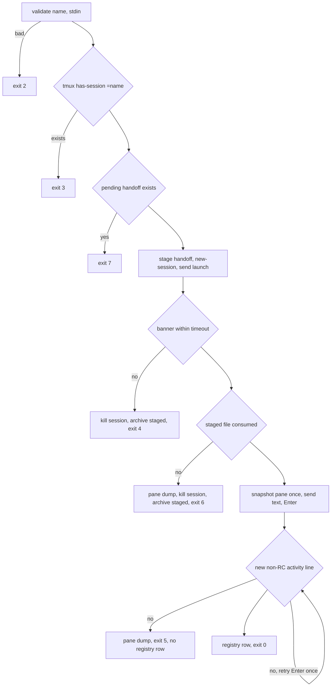

# Fork-Session Review Follow-ups - Plan

## Goal Capsule

- **Objective:** close the 22 findings of code-review run `20260916-212604-ac46e376` on the session-fork feature shipped in v0.52.10 and v0.53.0, so a fork works on every foundation instance and never reports success while the session is unusable.
- **Authority:** this plan's Requirements and KTDs govern; the review report (`/tmp/compound-engineering-502/ce-code-review/20260916-212604-ac46e376/report.md`) is evidence, not authority. Repo standards `AGENTS.md` S6 (no quiet failures) and `docs/testing-standard.md` S8 (failing test first) bind every unit.
- **Stop conditions:** a settled decision (KTD1, KTD2, or a labeled Key Decision) turns out infeasible; a change would require rewriting the user's shell rc block; any test in the Verification Contract cannot be made to pass without weakening it.
- **Execution profile:** one branch `fix/fork-session-review` in the hex-foundation worktree, a red test commit followed by a fix commit for each behavior-changing unit, merged to `develop` locally with no PR.
- **Tail ownership:** the caller (LFG) owns simplify, review, commit, and the local merge; the instance upgrade and live fork proof after release are outside this plan.

---

## Product Contract

### Summary

Fix the fork launcher (`system/scripts/hex-fork-session`), the SessionStart hook (`system/scripts/hex-handoff-inject`), the hooks merger (`system/scripts/hex-hooks-merge`), and `hex upgrade` so the fork mechanism is wired automatically on upgrade, fails loudly and cleanly on every partial-failure path, proves the kickoff was submitted, never destroys `settings.json`, and is documented in foundation terms. Also anchor the codex-parity gate's failure detection and update the test matrix.

### Problem Frame

The feature was promoted from an instance hack in one day and proven only on this instance. Review found two defects that make it fail on any other instance (default launch flag `--fresh`, hooks merge never run by `hex upgrade`), two that let it report success while the new session is unbriefed or the kickoff is unsent, and one that can wipe a user's `settings.json` on upgrade. The rest are partial-failure cleanup, a false name collision, doc drift, and dead code.

### Requirements

**Wiring on every instance**

- R1. `hex upgrade` merges `required-hooks.json` into `$HEX_DIR/.claude/settings.json` itself and prints one line per hook it adds; no doc-only step remains load-bearing.
- R1a. A missing required hook counts as work to do: `hex upgrade` does not report `Nothing to do` while any manifest command is absent from `settings.json`, and `--dry-run` lists the hooks it would add.
- R1b. A merge failure (merger exits non-zero, or the merger script is missing after sync) is a `[FAIL]` that makes `hex upgrade` exit non-zero; the existing `settings.json` is left untouched.
- R2. The hooks merger refuses to overwrite a `settings.json` that exists but is not valid JSON: non-zero exit, path and parse error on stderr, file bytes unchanged.
- R3. The hooks merger treats a manifest command as present when it equals one segment of an existing command for that event after splitting on `;`, `&&`, `||`, and newlines and trimming, so a chained command is not duplicated and a mention inside quoted text or a longer command does not count.
- R4. The hooks merger has no `script` manifest form; the manifest schema is `{event: [{matcher, command}]}`.

**Launcher fails loudly and cleanly**

- R5. The default launch command is `hex-new @name@` with no `--fresh`.
- R6. Name collision uses an exact tmux match (`=name`), so `foo` is not refused because `foo-bar` exists.
- R7. When the staged handoff is not consumed within the wait window, the launcher sends no kickoff, writes no registry row, prints the pane, kills the tmux session it created, moves the staged file to the archive as `<name>-unconsumed-<stamp>.md`, exits 6, and names that path and the re-fork command in the message.
- R8. When the banner never appears (exit 4), the launcher kills the tmux session it created and moves the staged handoff to the archive as `<name>-unconsumed-<stamp>.md`, naming the path in the message.
- R9. The launcher refuses to stage over an existing pending handoff for the same name (exit 7, path in the message).
- R10. The registry row is written only after the kickoff is proven submitted; on exit 5 no healthy row exists.
- R11. When the registry has no fleet-table row to append after, the launcher prints a WARN to stderr naming the registry path; the unused regex assignment is removed.

**Kickoff submit proof**

- R12. Submission is proven by a new activity line relative to a pane snapshot taken before Enter, never by glyphs already present in the pane or in the handoff; lines containing `Remote Control` are ignored because that link emits notices asynchronously.

**Handoff consumed exactly once**

- R13. The hook claims the staged file (moves it to the archive) before printing, and prints from the archive. A failed move exits 0 only when the pending file no longer exists (another run claimed it); any other move or archive-directory failure exits 1 with the paths on stderr and leaves the pending file in place.
- R14. The hook exits 0 without acting when the session name is not kebab-case.
- R15. The staged-handoff trust model (operator-written input on a single-operator machine) is stated in the hook header and the command doc.

**Release gate and docs**

- R16. `parity_failure_detail` reports only lines that start with `[FAIL]` or `FAIL:` after trimming; a line such as `PASS: no FAILures` is not reported.
- R17. `docs/testing.md` lists `test_fork_session.py` and `test_hooks_merge.py` in the Static / unit row and the no-API-key command list.
- R18. `system/commands/hex-fork-session.md` states that hook wiring comes from `required-hooks.json` via install and upgrade, carries an exit-code table (0, 2, 3, 4, 5, 6, 7), uses foundation terms only, and qualifies every instance path with `$HEX_DIR/`.
- R19. `system/commands/hex-upgrade.md` and `system/skills/hex-upgrade/SKILL.md` describe the hooks merge identically as a report line and name the same `.upgrade-cache` template path.
- R20. A test asserts the R17, R18, and R19 document content: the exit-code table rows, the `$HEX_DIR/` qualification, the test-matrix entries, and byte-identical hooks-merge report lines in both upgrade docs.

### Key Decisions

- **Mechanical hooks merge in the binary, docs report only.** `Governs R1, R19`. A prose step was skipped on this instance and the two upgrade docs had already drifted. (session-settled: user-approved — chosen over keeping Step 2b as a prose step in both docs: Standing Order 10, mechanical over verbal.)
- **No duplicate scripts or shims.** Governs the whole plan's file set. (session-settled: user-directed — chosen over alias scripts for compatibility: doubles were removed from the instance the same day.)
- **Trusted staged handoffs.** `Governs R15`. (session-settled: user-approved — chosen over a launcher-written sidecar marker before injection: the only writer of `.hex/run/handoffs` is the operator's own agent on a single-operator machine.)

### Scope Boundaries

- In scope: the 20 actionable findings plus #15 as documentation and #17 as no change.
- Out of scope: porting `hex-handoff-inject` to a `hex hook` Rust subcommand (residual design note from review); a native serde_json merge inside `upgrade.rs` (the binary shells out to the one merger so install and upgrade share one implementation).

### Deferred to Follow-Up Work

- Port the SessionStart hook to `hex hook handoff-inject` once the bash version is stable.
- Idempotency key for the hooks merger should include the matcher; today an identical command under a different matcher counts as present (review residual, theoretical).

---

## Planning Contract

### Key Technical Decisions

- KTD1. **`hex upgrade` shells out to `hex-hooks-merge` right after the hooks dir sync, and treats missing hooks as pending work.** Instantiates the Key Decision governing R1, R1a, R1b, R19. Add `required_hooks_missing(hex_dot_dir, workspace) -> bool` (the R3 segment test over the current `settings.json`, true when unparseable) to the up-to-date gate and the dry-run report, and `merge_required_hooks(hex_dot_dir, workspace) -> Result<Vec<String>, String>` beside `configure_hooks_path` in `system/harness/src/upgrade.rs`: `Ok(added)` carries the merger's stdout lines, `Err(msg)` a failure; Step 5 prints `[OK] <line>` per addition and pushes an `Err` into `failures` as `[FAIL]` (R1b). An absent manifest is a `[WARN]` skip, not a failure. One implementation serves install.sh and upgrade. (session-settled: user-approved — chosen over a native Rust merge: one merger, no doubles.)
- KTD2. **Default launch is `hex-new @name@`.** Foundation `hex_new_block()` forwards extra args to `claude`, and `claude` rejects `--fresh`. Instances with a resuming launcher set `HEX_FORK_LAUNCH`. (session-settled: user-approved — chosen over teaching `hex_new_block()` to strip `--fresh`: smaller change, no rc rewrite.)
- KTD3. **Submit proof is a snapshot diff.** Capture the pane once before the first Enter; after each Enter, poll and declare submitted only when a line matching the activity pattern (`⏺`, `esc to interrupt`, `✻`) appears that was absent from the snapshot and does not contain `Remote Control`. The snapshot is taken once, not per retry, so a late first submit is still seen. This excludes idle-pane notices, handoff content, and asynchronous Remote Control link notices. It does not prove which prompt was accepted; a stricter acknowledgement protocol is out of scope (see Risks). Open area resolved: snapshot-diff over input-line check, because Claude Code echoes the submitted prompt on a `❯` line too, so the input line cannot distinguish typed from submitted.
- KTD4. **Exit 4 and exit 6 kill the session the launcher created and archive the handoff.** Open area resolved: the launcher created the session (R6 exact-match guarantees it was absent), so killing it is safe and leaves no zombie; the pane dump on stderr keeps the evidence. The staged handoff is the operator's only on-disk copy when it came from a heredoc, so it is moved to `$HEX_HANDOFF_ARCHIVE/<name>-unconsumed-<stamp>.md`, never deleted. Re-fork is then `hex-fork-session <name> < <archived path>`.
- KTD5. **Claim before print.** `hex-handoff-inject` runs `mkdir -p archive_dir` and `mv pending archive` first. A failed `mv` exits 0 only when `pending` no longer exists (another run claimed it); a failed `mkdir` or a failed `mv` with `pending` still present exits 1 naming both paths and leaves the file for the next run. Then `cat archive`; a `cat` failure after the claim exits 1 with the archive path so the operator can recover it.
- KTD6. **Unconsumed handoff is exit 6, pending collision is exit 7.** New exit codes documented in the script header and the command doc; the kickoff never runs when the session is unbriefed. Exit 6 cleans up per KTD4 so the documented recovery (`hex upgrade`, then re-fork from the archived file) is not blocked by exit 3 or exit 7.
- KTD7. **Presence check is segment equality.** Split each existing command on `;`, `&&`, `||`, and newlines, trim, and compare each segment to the manifest command exactly. A chained hook counts as present; a mention inside an `echo` string or a longer command name does not. The same function backs `required_hooks_missing` in KTD1.
- KTD8. **Parity failure lines are anchored on `[FAIL]` and `FAIL:` prefixes.** `run-all.sh` prints the per-test summary as `[FAIL] name (exit N)`; the individual parity scripts print per-assertion detail as `FAIL: <name>` (for example `tests/codex-parity/test-agents-md-complete.sh`), so both prefixes are load-bearing.

### High-Level Technical Design

Launcher flow after this plan (exit codes in brackets):

### Assumptions

- `python3` is on PATH for `hex upgrade` (install.sh already requires it).
- `capture-pane -p` returns the visible region (80x24 for a detached session by default); the snapshot diff sorts both captures, so scroll position does not matter, only which lines are new.
- The `hex-new` shell function reaches the detached tmux pane because tmux's default command is an interactive shell that sources the user's rc (unchanged from today; failure surfaces as exit 4 with the pane).

### Sequencing

U1 first (merger contract), then U2 (binary calls the merger), then U3 and U4 (launcher), U5 (hook), U6 (release gate), U7 (docs) last so the exit-code table reflects the final script.

---

## Implementation Units

### U1. Harden hex-hooks-merge

- **Goal:** refuse malformed settings, detect chained commands, drop the dead manifest form.
- **Requirements:** R2, R3, R4. KTD7.
- **Dependencies:** none.
- **Files:** `system/scripts/hex-hooks-merge`, `tests/test_hooks_merge.py`.
- **Approach:**
  1. On `json.JSONDecodeError` exit non-zero with `hex-hooks-merge: <path> is not valid JSON (<err>); refusing to overwrite`; keep `{}` only when the file is absent.
  2. In the `command` form, present means the manifest command equals one trimmed segment of an existing command after splitting on `;`, `&&`, `||`, and newlines (R3, KTD7); expose that test as a function the Rust side can call through a `--check` flag that exits 0 when nothing is missing and 3 when something is.
  3. Delete the `script` branch; read `hook_def['command']` unconditionally (KeyError is the loud failure). Update the docstring with the manifest schema.
- **Execution note:** write the three failing tests first; each cites its finding number in the docstring.
- **Test scenarios:**
  - Malformed settings `{oops` -> non-zero exit, stderr names the path and `refusing`, file bytes unchanged.
  - Existing SessionStart command `hex memory recent; "$HEX_DIR"/.hex/scripts/hex-handoff-inject` -> merge prints nothing, entry count unchanged.
  - Existing command `echo "hex hook worktree-guard is off"` -> the manifest hook is still added (a mention inside a string is not presence).
  - `--check` exits 3 when a manifest hook is absent, 0 when all present, non-zero with the JSON error when settings.json is malformed.
  - Second run over an already-merged file prints nothing (idempotent).
  - Missing settings file -> created with only the manifest hooks.
  - Manifest entry without `command` -> non-zero exit (KeyError surfaced).
- **Verification:** `python3 -I -B tests/test_hooks_merge.py` green with the new cases; the old two cases still pass.

### U2. hex upgrade runs the hooks merge

- **Goal:** the binary wires required hooks on every upgrade and reports additions.
- **Requirements:** R1, R1a, R1b, R19. KTD1.
- **Dependencies:** U1.
- **Files:** `system/harness/src/upgrade.rs`, `system/commands/hex-upgrade.md`, `system/skills/hex-upgrade/SKILL.md`.
- **Approach:**
  1. Add `required_hooks_missing(hex_dot_dir, workspace) -> bool` (runs the merger with `--check` from the source tree's copy of the script so it works before sync; unparseable settings count as missing) and include it in the up-to-date gate and the dry-run report line `-> required hooks to merge: N`.
  2. Add `merge_required_hooks(hex_dot_dir: &Path, workspace: &Path) -> Result<Vec<String>, String>` beside `configure_hooks_path`: `Err` when the merger script is absent or exits non-zero (stderr in the message); `Ok(lines)` with the merger's stdout otherwise. An absent manifest returns `Ok(vec![])` after printing `[WARN] no required-hooks manifest`.
  3. Call it in Step 5 after the sync loop applies `hooks` and `scripts`; print `  [OK] <line>` per addition; push an `Err` into `failures` (rendered `[FAIL]`, non-zero exit) per R1b.
  4. Replace Step 2b in both docs with the identical report line: `hex upgrade` merges required hooks and prints `[OK] hook added: ...` per addition; nothing to run by hand. Reconcile the `.upgrade-cache` template path in both docs to `$HEX_DIR/.hex/.upgrade-cache/templates/AGENTS.md.template` (the path `hex upgrade` writes).
- **Patterns to follow:** `configure_hooks_path` (`upgrade.rs` ~1810-1848) for the child-process shape; tests `test_hooks_sync_lands_in_target` (~3670) for the tempdir fixture.
- **Execution note:** red first: the `required_hooks_missing` and `merge_required_hooks` tests fail to compile or fail against the unpatched file; commit them before the fix. The Step 5 call site itself has no whole-upgrade fixture in the crate today; cover the call site by asserting the gate uses the predicate (a synced tempdir instance with one missing hook is not `Nothing to do`) and record the remaining call-site gap in Risks.
- **Test scenarios:**
  - Tempdir instance with the real merger copied into `<hex>/.hex/scripts/`, a manifest with one SessionStart hook, and a settings.json lacking it -> `merge_required_hooks` returns `Ok` with one line and settings.json has the entry.
  - Same fixture run twice -> second run returns `Ok(vec![])`.
  - Malformed settings.json -> returns `Err` naming the path, file bytes unchanged.
  - Merger script absent -> returns `Err`; manifest absent -> `Ok(vec![])`.
  - `required_hooks_missing` is true for the fixture above and false after the merge; true for malformed settings.
  - Up-to-date gate: synced instance, no file changes, settings.json lacking one manifest hook -> the upgrade does not report `Nothing to do`; dry-run output lists `required hooks to merge: 1`.
- **Verification:** `cargo test -p hex-harness --lib upgrade::tests` green; `cargo fmt --all --check`; `cargo clippy -p hex-harness --all-targets --locked -- -D warnings` clean.

### U3. Launcher default and failure paths

- **Goal:** the launcher works on foundation instances and never leaves half state or a false OK.
- **Requirements:** R5, R6, R7, R8, R9, R10, R11. KTD2, KTD4, KTD6.
- **Dependencies:** none (parallel with U1/U2).
- **Files:** `system/scripts/hex-fork-session`, `tests/test_fork_session.py`.
- **Approach:**
  1. Default `launch="${HEX_FORK_LAUNCH:-hex-new @name@}"`.
  2. `tmux has-session -t "=$name"`.
  3. Before staging: `[[ -f "$stage/$name.md" ]]` -> `ERR: a handoff for '<name>' is already staged at <path>; remove or consume it first`, exit 7.
  4. On banner timeout: pane dump, `tmux kill-session -t "=$name"`, move the staged file to `$archive_dir/<name>-unconsumed-<stamp>.md`, print that path, exit 4.
  5. Consume wait becomes `HEX_FORK_INJECT_TIMEOUT` (default 20 s); if still staged: pane dump, `tmux kill-session -t "=$name"`, move the staged file to the archive as in step 4, print `ERR: handoff not consumed; the SessionStart hook is not wired (run hex upgrade), then re-fork: hex-fork-session <name> < <archived path>`, exit 6, no kickoff.
  6. Move the registry block after the submit check; exit 5 path writes nothing to the registry.
  7. Registry python: delete the unused `m = re.search(...)`; add `else: print(WARN..., file=sys.stderr)` when no fleet row.
- **Execution note:** extend the fake tmux first so each scenario fails on the old script: the fake `send-keys` handler evaluates the launch line it receives (`eval "$4"` with `HEX_SESSION_NAME=<name>` and `HEX_DIR` set) so both `FAKE-LAUNCH <name>` and the default `hex-new <name>` run the hook; a fake `hex-new` on PATH exits 1 on any `--` argument and otherwise runs `hex-handoff-inject` and touches a banner marker that fake `capture-pane` reads; `FAKE_NO_BANNER=1` (capture-pane prints nothing); `FAKE_NO_INJECT=1` (launch does not run the hook); fake `has-session` implements `=` exact vs prefix semantics; the test env sets `HEX_FORK_INJECT_TIMEOUT=1`.
- **Test scenarios:**
  - Default launch (HEX_FORK_LAUNCH unset) against fake `hex-new` that rejects unknown flags -> exit 0 and the logged launch has no `--fresh`.
  - `FAKE_EXISTING=foo-bar`, name `foo` -> proceeds (exit 0); name `foo-bar` -> exit 3.
  - Pending file already staged -> exit 7, stdin not written over it.
  - `FAKE_NO_BANNER=1`, `HEX_FORK_TIMEOUT=1` -> exit 4, `kill-session -t =name` in the call log, staged file gone, archived copy `<name>-unconsumed-*.md` present.
  - `FAKE_NO_INJECT=1` -> exit 6, no `-l` send in the call log, `kill-session -t =name` logged, staged file gone, archived copy present, stderr names the re-fork command, no registry row, no `OK:` on stdout.
  - `FAKE_NO_SUBMIT=1` -> exit 5 and the registry has no row for the name.
  - Registry with headings but no table rows -> exit 0, stderr contains `WARN: no fleet-table row`.
- **Verification:** `python3 -I -B tests/test_fork_session.py` green, including the existing 9 cases.

### U4. Kickoff submit proof by snapshot diff

- **Goal:** exit 0 only when the kickoff was actually submitted.
- **Requirements:** R12. KTD3.
- **Dependencies:** U3 (same file; land after U3 to avoid conflicting edits).
- **Files:** `system/scripts/hex-fork-session`, `tests/test_fork_session.py`.
- **Approach:**
  1. Before the first Enter, `before=$(tmux capture-pane -t "=$name" -p)`; taken once, not per retry.
  2. After each Enter, poll: `after=$(capture)`; `submitted=1` when `comm -13 <(sort <<<"$before") <(sort <<<"$after") | grep -v 'Remote Control' | grep -qE '⏺|esc to interrupt|✻'`.
  3. Retry Enter once as today; exit 5 unchanged.
- **Patterns to follow:** the existing poll loop shape in the script.
- **Test scenarios:**
  - Fake `capture-pane` always prints `⏺ Remote Control disconnected` plus the banner; after a typed+Enter sequence it adds `⏺ working` -> exit 0.
  - `FAKE_NO_SUBMIT=1` with the same baseline glyph present -> exit 5 after exactly two Enter sends.
  - Handoff body containing `✻` and `⏺` (injected output appears in the pane baseline) -> not counted; `FAKE_NO_SUBMIT=1` still exits 5.
  - `FAKE_NO_SUBMIT=1` and the fake pane gains `⏺ Remote Control connected` only after Enter -> still exit 5.
- **Verification:** `python3 -I -B tests/test_fork_session.py` green; the unsubmitted test fails on the pre-U4 script when the fake baseline glyph is added.

### U5. Handoff hook: claim first, name guard, trust note

- **Goal:** consumed-once semantics survive read failures and repeated hook runs.
- **Requirements:** R13, R14, R15. KTD5.
- **Dependencies:** none.
- **Files:** `system/scripts/hex-handoff-inject`, `tests/test_fork_session.py`.
- **Approach:**
  1. Guard `[[ "$name" =~ ^[a-z0-9][a-z0-9-]*$ ]] || exit 0` after name resolution.
  2. `mkdir -p "$archive_dir" || { echo "ERROR: cannot create $archive_dir" >&2; exit 1; }`; then `if ! mv "$pending" "$archive" 2>/dev/null; then [[ -e "$pending" ]] && { echo "ERROR: could not claim handoff $pending -> $archive" >&2; exit 1; }; exit 0; fi` (lost claim exits 0 only when the pending file is gone); then print header, `cat "$archive" || { echo "ERROR: handoff claimed but unreadable at $archive" >&2; exit 1; }`, trailer.
  3. Header comment: trust model per R15.
- **Test scenarios:**
  - Pending file exists -> stdout carries the body, archive exists, pending gone (existing test, keep).
  - `HEX_SESSION_NAME='../../x'` with a matching file planted at the traversal path -> empty stdout, exit 0, file untouched.
  - Two invocations for the same name back to back -> first prints, second prints nothing and exits 0.
  - Archive dir replaced by a regular file -> non-zero exit, `ERROR` on stderr, pending file still present (claim failed before print).
- **Verification:** `python3 -I -B tests/test_fork_session.py` green.

### U6. Anchor parity failure detection

- **Goal:** the gate names failed tests only.
- **Requirements:** R16. KTD8.
- **Dependencies:** none.
- **Files:** `system/harness/src/release.rs`.
- **Approach:** in `parity_failure_detail`, filter with `l.starts_with("[FAIL]") || l.starts_with("FAIL:")` on the trimmed line.
- **Test scenarios:**
  - Fixture output containing `PASS: no FAILures`, `[FAIL] test-widget (exit 1)`, `FAIL: widget missing` -> reason contains both FAIL lines and not the PASS line.
  - Ten `[FAIL]` lines -> exactly eight appear before `tail:`.
- **Verification:** `cargo test -p hex-harness --lib release::tests` green; fmt and clippy clean.

### U7. Docs

- **Goal:** the command doc matches the mechanism and the test matrix lists the new tests.
- **Dependencies:** U3, U4 (final exit codes).
- **Files:** `system/commands/hex-fork-session.md`, `docs/testing.md`, `docs/hex-ops.md`.
- **Approach:**
  1. Replace the Wiring section: wiring comes from `system/hooks/required-hooks.json`; install.sh and `hex upgrade` merge it into `$HEX_DIR/.claude/settings.json`; do not hand-edit.
  2. Add an exit-code table: 0 ok; 2 usage or empty handoff; 3 name exists, pick another; 4 no banner, session killed, handoff archived at the printed path, read the pane, fix `HEX_FORK_LAUNCH`, re-fork from the archived file; 5 kickoff typed but not submitted, session is up and briefed, run `tmux send-keys -t <name> Enter` and re-check; 6 handoff not consumed, session killed, handoff archived at the printed path, run `hex upgrade`, then `hex-fork-session <name> < <archived path>`; 7 a handoff is already staged for that name at the printed path, consume or remove it. Add one line: the hook resolves the session name from `HEX_SESSION_NAME` when set, otherwise from the tmux session name, so a custom `HEX_FORK_LAUNCH` must keep the runtime inside the tmux session the launcher created.
  3. Foundation terms: replace `hex-new-session`, `SO 3b`, `fleet table` with `hex-new <name>` in a tmux session, the plain rule text, and `sessions registry (if present)`; remove the quoted operator correction on line 8; remove bracketed optional flags from the runnable block and describe them in prose.
  4. Prefix instance paths with `$HEX_DIR/`.
  5. `docs/testing.md`: add both tests to the Static / unit row and two `python3 -I -B` lines to the no-API-key block. `docs/hex-ops.md`: add `--kickoff` and the exit codes to the fork section and change the stated `HEX_FORK_LAUNCH` default from `hex-new @name@ --fresh` to `hex-new @name@`.
  6. Add a `DocContractTests` case to `tests/test_fork_session.py` (R20): the command doc has table rows for exit codes 0, 2, 3, 4, 5, 6, 7; every `.hex/run/handoffs` and `projects/hex-ops` mention is `$HEX_DIR/`-qualified; `docs/testing.md` names both test files; the hooks-merge report line is byte-identical in both upgrade docs.
- **Requirements:** R17, R18, R19, R20.
- **Test scenarios:**
  - Doc contract test passes on the finished docs and fails when one exit-code row is removed.
- **Verification:** `python3 -I -B tests/test_fork_session.py` green; `bash tests/test_skill_refs.sh` green; `hex sanitize` clean on the tree.

---

## Verification Contract

| Gate | Command | Proves |
|---|---|---|
| Fork launcher and hook | `python3 -I -B tests/test_fork_session.py` | U3, U4, U5 scenarios |
| Hooks merger | `python3 -I -B tests/test_hooks_merge.py` | U1 scenarios |
| Install caller shape | `python3 -I -B tests/test_macos_install_caller.py` | install.sh still sources cleanly |
| Harness crate | `cargo test -p hex-harness` (from `system/harness`) | U2, U6 plus no regressions |
| Format | `cargo fmt --all --check` | clean |
| Lint | `cargo clippy -p hex-harness --all-targets --locked -- -D warnings` | clean |
| Doc refs | `bash tests/test_skill_refs.sh` | U7 |
| Personalization | `hex sanitize` | no operator-specific content in foundation files |

Red-first proof: for U1, U2, U3, U4, U5, U6 the new test must fail against the pre-change file before the fix commit; commit the test and the fix separately (`test(...)` then `fix(...)`) per `docs/testing-standard.md` section 4.

---

## Risks

- Cross-instance proof: no second foundation instance is available in this environment, so R5 and R1 are proven by fake-launch tests plus the live fork on this instance after release. A second-instance acceptance run is the first thing to do when one exists.
- The Step 5 call site in `upgrade.rs` has no whole-upgrade test fixture; the gate predicate and the merge function are tested directly, and the wiring is verified by the live upgrade after release.
- The submit proof (KTD3) shows that new activity appeared after Enter; it does not prove which prompt the session accepted. Startup output arriving inside the 10 s poll could still count. A launcher-owned acknowledgement in the kickoff would change the kickoff's meaning for the receiving agent; not adopted.
- Between the hook's claim (`mv`) and the end of its print, the launcher's consume-wait already passes. Claude Code runs SessionStart hooks to completion before it reads the first prompt, so the typed kickoff waits in the input buffer; the 2 s `HEX_FORK_KICKOFF_DELAY` is a margin, not a guarantee.
- `HEX_HANDOFF_ARCHIVE` on a different filesystem makes `mv` copy-then-unlink and the claim non-atomic; defaults keep both paths under `$HEX_DIR`.

---

## Definition of Done

- All 22 requirements (R1 to R20 with R1a, R1b) met; every unit's tests green; all Verification Contract gates clean.
- Each bug-fix unit has a red test commit preceding its fix commit in `git log`.
- No `.hex/bin` shim, alias, or duplicate copy of any script introduced.
- Branch merged to `develop` locally in the releaser's clone (`~/github.com/mrap/hex-foundation`); no PR opened; no dead-end code left in the diff.
- Follow-up (outside this plan): release, `/hex-upgrade`, and a throwaway fork on the instance proving exit 0 with the new submit check.
