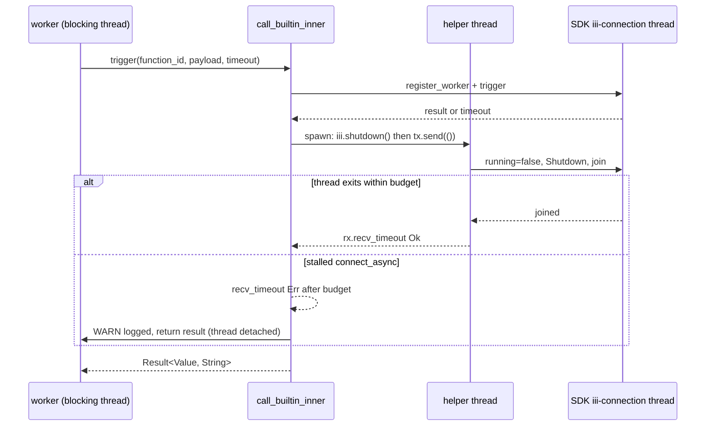

# fix: harden the fd-leak fix per review

**Target repo:** hex-foundation (branch `fix/fd-leak-review-followups` off `develop` at e068bcb6, which already ships the v0.53.2 fd-leak fix).

## Summary

v0.53.2 stopped `ops::call_builtin` leaking an iii client per call and raised the harness fd limit at startup. Code review of that change validated four follow-ups: the new teardown can block a worker forever on a stalled WebSocket handshake; the two new fd/rlimit tests share process-wide state with ~925 parallel unit tests and one of them is vacuous on Linux CI; and a failed rlimit raise never reaches telemetry. This plan lands all four with tests that fail before the change and pass after, in one PR to `develop`.

Product Contract preservation: n/a (direct planning, no origin brainstorm).

---

## Problem Frame

`hex harness serve` is a long-lived launchd daemon. Workers inside it call `ops::state_get`, `state_set`, and `emit` (hex-watch every 5 minutes, resources hourly, every `ctx.emit`). After v0.53.2 each call registers an SDK client, triggers, then calls `iii.shutdown()`, which joins the SDK's `iii-connection` OS thread. The SDK's reconnect loop awaits `connect_async` with no handshake timeout, so if the engine accepts TCP but never answers the HTTP upgrade, that join never returns and the calling worker wedges (finding #1, corroborated by an independent model).

The regression test that guards the leak counts `/dev/fd` entries with a +2 tolerance inside the shared `--lib` binary while hundreds of other tests open sockets and child pipes; it can flake, and the testing standard bans `#[ignore]` for flakiness (#2). The rlimit test asserts `soft > 256`, which is already true on ubuntu-latest (ambient 1024) so it proves nothing there (#5). The rlimit raise's failure arm only prints to stderr, so `hex failures` never sees it, against S6 (#4). A fifth finding (#3, test and fix landed in one commit) is a process observation with no code action; it is listed under Deferred.

---

## Requirements

- **R1.** `call_builtin` never blocks its caller on client teardown for longer than a fixed budget, even when the engine accepts TCP and never completes the WebSocket handshake. Overrunning the budget is logged loudly and the connection thread is detached, never joined forever.
- **R2.** In the normal paths (engine reachable, or connect refused) the fd guarantee from v0.53.2 still holds: no fds remain after the call returns.
- **R3.** The fd-count and rlimit tests run in their own integration binary (`--test fd_limits`), serialized against each other, so no unrelated test can perturb the fd count.
- **R4.** The rlimit test starts from the launchd default (soft 256) before asserting the raise, so it fails on any host if the raise stops working.
- **R5.** A failed `RLIMIT_NOFILE` raise records a telemetry error row (`source=harness`, event `rlimit::nofile`) in addition to the stderr line.
- **R6.** `cargo fmt`, `cargo clippy -p hex-harness --all-targets -- -D warnings`, `cargo test -p hex-harness`, and `cargo test -p hex-harness --test fd_limits` are green. The pinned `iii-sdk` is not modified.

---

## Scope Boundaries

- In scope: `system/harness/src/ops.rs`, `system/harness/src/worker/runtime.rs`, new `system/harness/tests/fd_limits.rs`.
- Out of scope: any change to the `mrap/hex-iii` SDK fork (lockstep pin; separate release), a runtime fd health check worker, a shared long-lived iii client.

### Deferred to Follow-Up Work

- A success-path fd test (engine reachable) needs a live engine; today only the `#[ignore]`d `state_roundtrip_live` covers it. Leave as is; note in the PR.
- Runtime fd/thread health check in `hex-resources` so a future leak surfaces in minutes, not days (review residual risk).
- Process learning from finding #3 (test and fix in one commit): no code action, history is published.

---

## Key Technical Decisions

- **KTD1. Bounded join, not `shutdown_async`.** Run `iii.shutdown()` on a helper thread and wait on a channel with a fixed budget (5 s production default). On time, the thread is joined and every fd is gone (R2). On overrun, log `WARN` to stderr, drop the receiver, and return; the helper thread finishes whenever `connect_async` resolves. `shutdown_async()` was rejected because it never joins, so the normal path would keep the thread and sockets alive for an unbounded time after the call returns, which reintroduces the leak shape the incident fix removed. (session-settled: user-approved for staying in ops.rs; the SDK is not touched, chosen over adding a handshake timeout inside `run_connection`: SDK rev bump is a separate release-scale change.)
- **KTD2. The budget is a parameter of an inner function.** `call_builtin_with_timeout` becomes `pub` and gains a `shutdown_budget: Duration` argument on an inner form so the integration test can use a sub-second budget; the public `call_builtin` keeps `None` timeout and the 5 s default. Exposing it is documented as "for the fd_limits integration binary".
- **KTD3. One integration binary, serialized.** `tests/fd_limits.rs` holds both tests and a file-level mutex so they never run concurrently within the binary. Cargo integration tests are separate processes, so the `--lib` binary's fds are out of the picture (R3). The stalled-handshake test lives there too because it parks a thread for the process lifetime.
- **KTD4. Lower before raise.** The rlimit test calls `setrlimit` to soft=256 (hard unchanged) first, then `raise_nofile_soft_limit`, and asserts `soft == min(hard, 10240)` and that 300 files open (R4). Safe only because the binary is isolated and serialized (KTD3).
- **KTD5. Telemetry via a small reporting helper.** Extract the match on `raise_nofile_soft_limit()` into `report_nofile_limit(result)` in `worker/runtime.rs` so the Err arm's telemetry write is unit-testable with the existing `telemetry::test_support` tempdir HEX_DIR helper, mirroring the drain-timeout arm's `record_loud` call shape.
- **Settled (user-approved): do not split commit c446c728** to satisfy test-first ordering. Rejected alternative: interactive rebase. Reason: v0.53.2 is published; S1 forbids history rewrite.

---

## High-Level Technical Design

Teardown flow after this change (directional):

---

## Implementation Units

### U1. Bounded client teardown in `ops::call_builtin`

**Goal:** never block a caller on `shutdown()` past a fixed budget; keep full fd release in the normal path.
**Requirements:** R1, R2 (KTD1, KTD2).
**Dependencies:** none.
**Files:** `system/harness/src/ops.rs`; create `system/harness/tests/fd_limits.rs` (with the file-level serialization mutex from KTD3) and add the stalled-handshake test there.
**Approach:**
1. Add `pub const SHUTDOWN_JOIN_BUDGET: Duration = 5s` and an inner `fn call_builtin_inner(function_id, payload, timeout_ms, shutdown_budget)`.
2. After `rt.block_on(trigger)`, clone the client, spawn a named helper thread (`iii-shutdown`) that calls `shutdown()` and sends on an `mpsc` channel; `recv_timeout(shutdown_budget)`.
3. On timeout, `eprintln!` a `WARN` naming the budget and the url, then return the trigger result unchanged.
4. Add `pub fn call_builtin_with_timeout_and_budget(function_id, payload, timeout_ms, shutdown_budget)` delegating to the inner form, with a doc line saying it exists for the `fd_limits` integration binary.
5. Make `call_builtin_with_timeout` `pub` and have it call the budget form with `SHUTDOWN_JOIN_BUDGET`; `call_builtin` unchanged in behavior.
**Execution note:** write the stalled-handshake test first and watch it hang or exceed the bound on current code; then implement.
**Patterns to follow:** the existing doc comment style in `ops.rs`; S6 loud-failure wording used elsewhere (`hex harness serve: WARN ...`).
**Test scenarios (in `tests/fd_limits.rs`):**
- Stalled handshake: bind a `TcpListener` on 127.0.0.1 and never accept; call `call_builtin_with_timeout_and_budget("state::get", payload, Some(200), 500ms)`; assert `Err`, and elapsed under 200 ms + 500 ms + 1 s slack.
- Refused connect (existing behavior): dropped listener port; assert `Err` and elapsed under 200 ms + ~2.5 s (SDK 2 s reconnect sleep) and fds return to baseline (shared with U2's fd test).
- Default budget wrapper: `call_builtin_with_timeout(..., Some(200))` on a refused port returns `Err` (compile-level proof the public wrapper still works).
**Verification:** `cargo test -p hex-harness --test fd_limits` green; the stalled test fails (times out past the bound) when the bounded join is reverted.

### U2. Move the fd-count test to an isolated, serialized integration binary

**Goal:** the leak regression test cannot be perturbed by other tests (R3).
**Requirements:** R3 (KTD3).
**Dependencies:** U1 (uses the pub entry point).
**Files:** `system/harness/tests/fd_limits.rs` (created in U1); delete the fd test and `open_fd_count` helper from `system/harness/src/ops.rs`.
**Approach:**
1. Reuse the binary and `static SERIAL: Mutex<()>` from U1; every test takes the guard first (poisoned guards recovered).
2. Port `open_fd_count` (`/dev/fd` entry count) and the 3-call refused-port test verbatim, using `hex::ops::call_builtin_with_timeout` and `hex::ops::state_payload`; set `III_URL` inside the guard and restore it.
3. Keep the incident citation in the test doc comment.
**Patterns to follow:** `tests/macos_app_admission.rs` (integration binary shape, `#![cfg(...)]` where needed). Unix-only: gate the file with `#![cfg(unix)]`.
**Test scenarios:**
- Refused port, 3 calls with 200 ms timeout: fd count returns to baseline within 10 s; fails 4 to 18 fds without the shutdown call (already proven in v0.53.2, re-verified once by commenting the join).
**Verification:** `cargo test -p hex-harness --test fd_limits` green; `cargo test -p hex-harness --lib ops::` no longer contains the fd test.

### U3. Rlimit test starts from the launchd default

**Goal:** the raise is proven on every host, not only where ambient soft is 256 (R4).
**Requirements:** R4 (KTD4).
**Dependencies:** U2 (same binary and mutex).
**Files:** `system/harness/tests/fd_limits.rs`; delete `raise_nofile_soft_limit_lifts_soft_limit_above_launchd_default` from `system/harness/src/worker/runtime.rs`.
**Approach:**
1. Under the mutex: `getrlimit`, set soft=256 (hard unchanged) via `libc::setrlimit`, call `hex::worker::runtime::raise_nofile_soft_limit()`.
2. Assert `soft == min(hard, 10240)` on macOS and `soft == hard` elsewhere, `soft > 256`, idempotent second call, and 300 `/dev/null` opens succeed.
3. `libc` is already a dependency of the crate; confirm it is usable from the integration binary (add to `[dev-dependencies]` only if the build says so).
**Test scenarios:**
- Ambient soft lowered to 256, then raise: soft equals the clamp target; 300 opens succeed.
- Skip with a loud message (not `#[ignore]`) only if the hard limit is below 300, which no supported lane has.
**Verification:** test fails when `raise_nofile_soft_limit` is stubbed to a no-op; `cargo test -p hex-harness --test fd_limits` green.

### U4. Telemetry row on rlimit raise failure

**Goal:** `hex failures` sees a failed raise (R5, S6).
**Requirements:** R5 (KTD5).
**Dependencies:** none.
**Files:** `system/harness/src/worker/runtime.rs` (helper + unit test in its `tests` module).
**Approach:**
1. Extract `fn report_nofile_limit(result: Result<(u64, u64), String>)`: Ok logs the existing line; Err logs the WARN and calls `crate::telemetry::record_loud` with `source="harness"`, `event="rlimit::nofile"`, `status="error"`, `detail=Some(err)`.
2. `serve()` calls `report_nofile_limit(raise_nofile_soft_limit())`.
**Patterns to follow:** drain-timeout arm at `runtime.rs` (`record_loud` with `TelemetryEvent`), telemetry `test_support` tempdir HEX_DIR helper used by other telemetry tests.
**Test scenarios:**
- `report_nofile_limit(Err("setrlimit: EPERM".into()))` under the test_support HEX_DIR tempdir: one row with event `rlimit::nofile`, status `error`, detail containing `EPERM`.
- `report_nofile_limit(Ok((10240, u64::MAX)))`: no error row recorded.
**Verification:** `cargo test -p hex-harness --lib worker::runtime::tests::` green.

---

## Verification Contract

- `cargo fmt --all --check`
- `cargo clippy -p hex-harness --all-targets -- -D warnings`
- `cargo test -p hex-harness` (lib + all test binaries, includes `fd_limits`)
- `cargo test -p hex-harness --test fd_limits` run twice in a row to check stability.
- Manual once: revert the bounded join locally and confirm the stalled-handshake test fails by exceeding its bound.

## Definition of Done

- All four findings addressed (U1 to U4) with tests that fail before and pass after.
- No `#[ignore]` added; no SDK change; no new dependency beyond `libc` dev-dep if required.
- Gates above green; PR to `develop` opened with the review run id in the description.

## Assumptions

- Cargo integration binaries run tests in parallel threads within one process; the file mutex is required for correctness (not just tidiness).
- The SDK's 2 s reconnect sleep is the only tail in the refused-port path; the 5 s production budget therefore never fires in that path.

## Risks

- A detached `iii-connection` thread after a budget overrun keeps its socket until the OS connect or handshake resolves; bounded by the pathological engine, logged loudly. Accepted.
- `setrlimit` lowering soft to 256 in the test process: safe only in the isolated, serialized binary. Never add this to the `--lib` suite.
