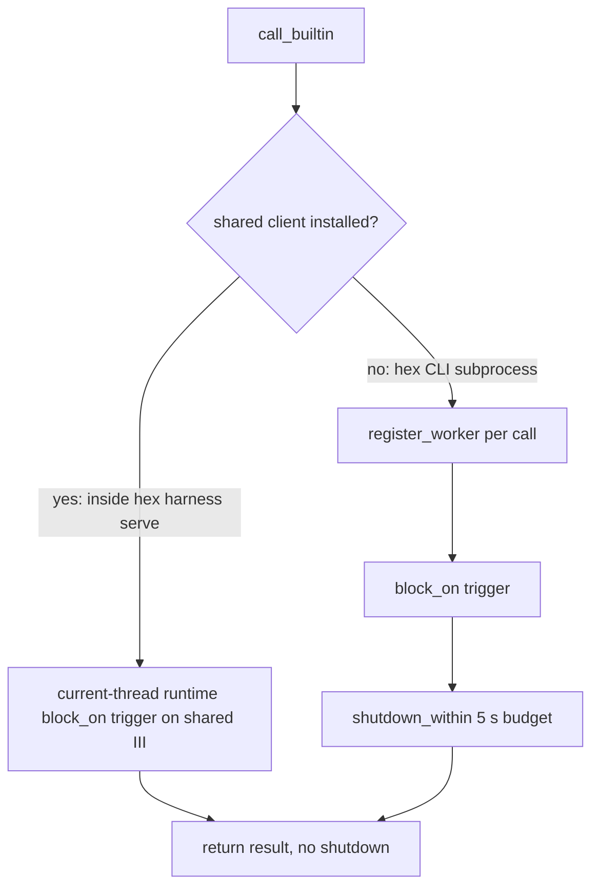
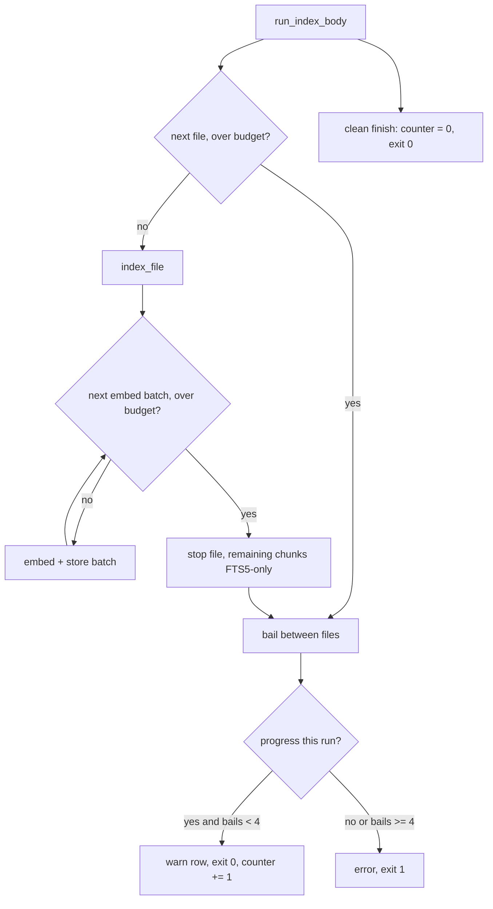

# Known Open Harness Failures - Plan

## Goal Capsule

- **Objective:** close the five harness failures still open on the mrap instance after the 2026-09-17 fd-leak incident: the nightly lane that never reports a full tally, the memory index budget noise, distill judge truncation, telemetry pollution from tests, and the per-call iii client residual inside `hex harness serve`.
- **Authority:** this plan, then `docs/testing-standard.md`, then repo conventions. A unit overrides neither.
- **Execution profile:** six units, dependency-ordered, each an atomic commit pair (failing test, then fix) where the unit fixes a bug.
- **Stop conditions:** a unit needs a change to the pinned `iii-sdk` fork, a change to instance config, or a product decision not recorded here. Report and stop instead of guessing.
- **Tail ownership:** the calling pipeline owns simplify, review, PR, and CI.

---

## Product Contract

### Summary

Make the nightly container lane report every test every night, make the index budget bail a resumable warning instead of a daily error, stop the distill judge from truncating its own JSON, sandbox `HEX_DIR` for every cargo-launched process so tests cannot write into a live telemetry store, and give `hex harness serve` one long-lived iii client for the in-process call path so a stalled engine cannot accumulate threads and sockets.

### Problem Frame

`hex failures` on 2026-09-17 still lists these after the v0.53.3 upgrade. The nightly lane (`hex-nightly-tests::nightly`) has exited 100 on every run since 2026-09-15 at test 80 of 1547 because it runs `--run-ignored all` without `--no-fail-fast`, and three `#[ignore]` tests need host-only resources. `hex memory index` has 243 error rows since 2026-07-09 for a budget bail that resumes on the next tick; the latest run spent 827 s on one 176-chunk file under the background-priority throttle. The distill judge runs at `max_tokens: 256` on a model whose reasoning tokens count against that cap, so its JSON decision is cut off. A test that records telemetry without isolating `HEX_DIR` writes into the live instance store when run from a hex session (one stray row was deleted by hand today). The per-call iii client in `ops::call_builtin` still leaks one detached connection thread plus socket per call when the engine accepts TCP but never finishes the websocket handshake.

### Requirements

**Nightly lane**

- R1. The nightly lane runs every test to completion and reports the full tally, so one failure never hides the rest.
- R2. Tests that need a host-only resource (a live iii engine, a live user config file) are excluded from the container run by a mechanical rule, not deleted and not made to pass by skipping inside the test body.
- R3. The Codex hook hash has a deterministic test that proves parity with a hash Codex itself wrote, and that test runs in every lane.

**Memory index budget**

- R4. A run over its wall-clock budget stops at the next embed-batch boundary inside a file, not only between files.
- R5. Chunks whose vectors were not stored when a run stopped stay searchable through FTS5 and are re-embedded by the existing backfill on later ticks.
- R6. A budget bail that made progress exits 0 and records a `warn` telemetry row; a bail with zero progress, or the fourth consecutive bail without an under-budget run between, exits 1 and stays an error.

**Distill judge**

- R7. The `memory_judge` use case has enough output budget that a JSON decision is not cut off by hidden reasoning tokens.
- R8. A provider response with `finish_reason == "length"` is reported as a named truncation error, distinct from a parse failure.

**Telemetry isolation**

- R9. Every process cargo launches from this workspace (unit tests, integration tests, nextest, `cargo run`) sees the sandbox `HEX_DIR` `/tmp/hex-test-hex-dir`, even when the shell exports a live `HEX_DIR`.
- R10. A test proves the sandbox is active, so removing it fails loudly.
- R11. Production telemetry is not dropped; the installed binary keeps writing to the configured `HEX_DIR`.

**iii client residual**

- R12. Inside `hex harness serve`, `ops::call_builtin` uses the process's one long-lived iii client and creates no per-call client, thread, or socket.
- R13. Outside `serve` (short-lived `hex` CLI subprocesses), the per-call client path is unchanged, including its bounded shutdown.

### Success Criteria

- The next nightly run reports the full eligible tally (1544 today; the three `_live` tests are excluded by the profile and run on the host) with zero failures, and the `hex-nightly-tests::nightly` row is `ok`.
- `hex failures` shows no new `hex-memory-maintenance::index` error row for a bail that indexed at least one file.
- Three calls through `ops::call_builtin` inside a process with the shared client installed return the open fd count to its pre-call baseline.
- A provider response with `finish_reason: "length"` surfaces as `ProviderError::Truncated`, and a judge decision at the new cap parses whole.
- A cargo-launched test run with a live `HEX_DIR` exported in the shell writes to `/tmp/hex-test-hex-dir`, and the built binary run outside cargo with an explicit `HEX_DIR` writes to that directory.

### Scope Boundaries

- Not in scope: the `agent-infra-proposer` whitelist false-fail (instance module), `hex-freshness` ledger staleness, instance config, the `hex-iii` fork.
- Not in scope: baking the nomic ONNX model into the lane image; model tests download it today and pass in 10 s each.

#### Deferred to Follow-Up Work

- SDK-side handshake timeout in `run_connection` of the `hex-iii` fork (`sdk/packages/rust/iii/src/iii.rs`, the two `connect_async(...).await` calls). Needs one commit in the fork plus a lockstep `rev` bump for both `iii-sdk` and `iii_engine` in `system/harness/Cargo.toml`. This plan closes the leak inside `serve` (R12); the CLI subprocess path relies on process exit.
- Running the lane from a git worktree fails `sanitize::tests::parity_full_tree_scan_is_clean` because the worktree's `.git` file points at a host path the container cannot see. The nightly runs from the main checkout, where it passes. A lane script fix would bind-mount the resolved `gitdir`.
- Three independent `HEX_DIR` isolation helpers exist (`telemetry::test_support`, `main.rs` `test_env`, `tests/telemetry_store.rs`). Consolidation is separate work.
- A retry with a larger cap when the judge returns a truncated response.
- `nextest` in the lane image is installed from `latest`, unpinned.

---

## Planning Contract

### Key Technical Decisions

- KTD1. **Host-only tests carry a `_live` name suffix and the lane runs a `nightly` nextest profile whose `default-filter` excludes them.** One naming rule plus one config line, both mechanical. Rejected: a skip inside the test body when the resource is absent (a silent pass, forbidden by the standard); deleting the tests (they are the only live-parity checks); a test that scans `src/` for `#[ignore]` attributes without the suffix (the standard forbids tests that read `src/` text). A future host-bound test added without the suffix shows up as one red row in the full nightly tally, which is the loud path.
- KTD2. **The lane argv adds `--no-fail-fast` and `--profile nightly`.** The full tally is the point of a nightly run. Rejected: leaving fail-fast and fixing tests one per night.
- KTD3. **The Codex parity fixture is captured from a real Codex-written entry whose command carries no personal path.** The entry `pre_tool_use` with matcher `Write|Edit|MultiEdit|NotebookEdit` and command `hex hook worktree-guard` exists in the instance's `~/.codex/config.toml` state table; its `trusted_hash` is the expected value, pinned verbatim in U2. The tree's sanitize scan forbids personal paths, so entries with `/Users/...` commands are not eligible. The live test keeps running on the host under its new `_live` name.
- KTD4. **The within-file budget is an injected `over_budget` predicate checked between embed batches.** `embed_and_store` already takes an injected embed closure and commits per batch, so a predicate slot beside it keeps the seam testable without the model or a clock. Rejected: a within-batch abort (a batch is one forward pass; nothing to interrupt) and a timing assertion (forbidden).
- KTD5. **Exit code encodes progress: a bail with progress exits 0 and records a `warn` row itself; zero progress or the fourth consecutive bail exits 1.** `hex failures` and the storm detector read `error|panic|failed` only, so `warn` keeps the event visible in `hex telemetry recent` without an alert. The consecutive counter lives in the existing `metadata` table of `memory.db` and resets on any run that finishes under budget. A reset on an under-budget run is correct: the bail message's `unprocessed` count is the remainder of the file iteration, most of it unchanged by mtime, and the tick after today's 827 s bail finished in 6.4 s, which shows the remainder drains on the next tick. Bails on every tick, or a bail with no progress, are the stuck signatures and stay errors. Progress means at least one file whose `index_file` completed without the predicate firing, or at least one embed batch stored. A file whose FTS5 rows were committed but whose first batch never stored is not progress: the run could not embed one batch inside the budget, which is the stuck signature. Rejected: keeping exit 1 (243 alerts for a self-healing condition); exit 0 with no row (quiet).
- KTD6. **`memory_judge` `max_tokens` becomes 4096 and provider parsing gains a pure `parse_chat_response` with a `ProviderError::Truncated` variant.** The judge output is one small JSON object; the cap only needs headroom for hidden reasoning. `consolidate_audit` needed 16384 because it emits a long audit body, which the judge does not. A cap is not a spend, and 4096 keeps a runaway reasoning turn bounded on a per-candidate call. A pure parse function is the only way to test `finish_reason` handling without a mock HTTP server, which the crate does not have.
- KTD7. **`HEX_DIR` is sandboxed by `.cargo/config.toml` `[env]` with `force = true`, pointing at the absolute path `/tmp/hex-test-hex-dir`.** Cargo and nextest both apply `[env]` to the processes they launch, so unit tests, integration binaries, and `cargo run` are all covered with no code change and no runtime test-mode branch. `force` is required because hex sessions export a live `HEX_DIR`. The path is absolute, not `relative = true` under `target/`, because the lane container runs as root against a bind mount and a repo-relative sandbox would leave root-owned files in the host tree that the worktree cleanup cannot delete; `/tmp` is container-local there and per-machine on the host. Rejected: `cfg!(test)` in the write path (does not cover integration binaries); a runtime "under test" detector (no reliable signal, and a production branch that decides whether to write telemetry is itself a quiet-failure risk). Consequence: a developer who wants a cargo-built binary to target a live instance runs `target/debug/hex` directly.
- KTD8. **`serve` installs its existing long-lived client into a process-wide `OnceLock` in `ops`, and `call_builtin` uses it when present.** `worker::runtime::serve` already creates one `iii_sdk::register_worker` client at startup and handlers run on `spawn_blocking` threads, so `call_builtin` can `block_on` `trigger` on a current-thread runtime against that client with no shutdown. The SDK loop already reconnects. Rejected: a new global built by `ops` itself (duplicates the client `serve` owns and the `III_URL` resolution); an SDK handshake timeout in this PR (fork change plus lockstep bump, deferred).

### High-Level Technical Design

Call path for `ops::call_builtin` after KTD8:

Index run with the within-file budget (KTD4, KTD5):

### Assumptions

- The nightly lane repo is the main checkout, where `parity_full_tree_scan_is_clean` passes (verified 2026-09-17: the lane run from the main checkout passes it in 3.5 s; a directory `.git`, git present, `safe.directory '*'` set in the image).
- Nextest `latest` in the image supports `default-filter` in profiles (added in 0.9.72; the image pulls a 2026 release).
- The consecutive-bail threshold of 4 (one hour of 15-minute ticks) is a starting value; `HEX_INDEX_BAIL_ESCALATE` is not added unless a reviewer asks.
- The release battery's `cargo test --workspace` gate is meant to run sandboxed; no gate script runs `cargo run` against a live `HEX_DIR` (`system/scripts/*.sh` and `release.rs` reference `HEX_DIR` only through `env.sh` and Python tools that do not go through cargo). U5 re-checks this before commit.

### Sequencing

U1 and U2 are independent. U3, U4, U5 are independent of each other and of U1/U2. U6 depends on U5 because its integration test relies on the `HEX_DIR` sandbox to be safe under a hex session, so it lands last. Recommended order: U5, U1, U2, U3, U4, U6.

---

## Implementation Units

### U1. Nightly lane reports the full tally and excludes host-only tests

- **Goal:** the container lane runs every test, including ignored model tests, and skips only host-bound `_live` tests by rule.
- **Requirements:** R1, R2 (KTD1, KTD2)
- **Dependencies:** none
- **Files:**
  - `.config/nextest.toml` (new, workspace root)
  - `system/harness/src/modules/nightly_tests.worker.rs` (argv, module doc)
  - `system/harness/src/codex_hook_hash.rs` (rename the live test to `trusted_hash_matches_codex_written_entry_live`, add a reason string)
  - `system/harness/src/ops.rs` (add a reason string to `state_roundtrip_live`)
  - `docs/testing-standard.md` (one rule line)
- **Approach:**
  1. Add `[profile.nightly]` with `default-filter = 'not test(/_live$/)'` to `.config/nextest.toml`. Keep the default profile untouched.
  2. `lane_argv` passes `--profile nightly --no-fail-fast --run-ignored all` after `--`.
  3. Rename the Codex live test and give both host-only tests `#[ignore = "..."]` reason strings naming the live resource, per the standard.
  4. Replace the stale "twelve model tests" module doc with the verified count and the `_live` rule.
  5. Add the rule to the standard: a test that needs a host-only live resource ends in `_live`; the `nightly` profile excludes it from the container.
- **Execution note:** write the `lane_argv` assertion first; it fails on the current argv.
- **Patterns to follow:** `lane_argv_runs_the_lane_with_run_ignored_all` in `nightly_tests.worker.rs`.
- **Test scenarios:**
  - `lane_argv` output contains `--no-fail-fast`, `--profile nightly`, and `--run-ignored all`, and the repo path stays the last element.
  - `.config/nextest.toml` parses as TOML and its `profile.nightly.default-filter` equals `not test(/_live$/)` (read the file from `CARGO_MANIFEST_DIR/../..`).
  - Every `#[ignore]` in `system/harness/src` whose name ends in `_live` carries a reason string (a source-shape check is not a behavior test; do this by hand in review, not as a test).
- **Verification:** `cargo nextest run -p hex-harness --lib -E 'test(/lane_argv|nextest_profile/)' --no-tests=fail` passes. `bash system/scripts/test-lane.sh -- --profile nightly --no-fail-fast --run-ignored all` from the worktree reports a full tally with the parity scan as the only failure (worktree `.git` file, see Deferred); from the main checkout, zero failures.

### U2. Deterministic Codex hash parity fixture

- **Goal:** the hash Codex wrote for a real trusted hook is reproduced by `hook_hash` in a test that runs everywhere.
- **Requirements:** R3 (KTD3)
- **Dependencies:** none
- **Files:**
  - `system/harness/src/codex_hook_hash.rs` (new fixture constants and test)
- **Approach:**
  1. The fixture is fixed here, captured 2026-09-17 from Codex CLI 0.154.0 on the instance (state key `<HEX_DIR>/.codex/hooks.json:pre_tool_use:0:0`): event label `pre_tool_use`, matcher `Write|Edit|MultiEdit|NotebookEdit`, handlers `[{"type":"command","command":"hex hook worktree-guard"}]`, expected `sha256:96b28df6d719740da58b88bb770bdb9edabfafa79a3091253911eb425814a5a9`. Use these values verbatim; do not substitute another entry. The constants contain no personal path.
  2. Apply the same normalization the live test applies (event label, matcher, timeout absent, async absent, `additional_context_limit` rules) and assert `hook_hash` returns the captured hash.
  3. Document the fixture's provenance (Codex version, capture date) in the fixture comment, mirroring Fixture 1 and 2.
- **Patterns to follow:** `F1_CANONICAL` / `F1_HASH` tests in the same module.
- **Test scenarios:**
  - `hook_hash("pre_tool_use", Some("Write|Edit|MultiEdit|NotebookEdit"), <handler json>)` equals the captured `sha256:` string.
  - The same input with the matcher removed produces a different hash (guards against a fixture that ignores the matcher).
- **Verification:** `cargo nextest run -p hex-harness --lib -E 'test(/codex_hook_hash/)' --no-tests=fail` passes, and the `_live` variant still passes on the host with `--run-ignored all -E 'test(/codex_written_entry_live/)'`.

### U3. Within-file index budget and progress-aware bail reporting

- **Goal:** a slow file cannot carry a run 227 s past its budget, and a resumable bail is a warning, not an alert.
- **Requirements:** R4, R5, R6 (KTD4, KTD5)
- **Dependencies:** none
- **Files:**
  - `system/harness/src/memory/index.rs` (`embed_and_store`, `index_file`, `run_index_body`, `run_index`, budget doc comment, tests)
  - `system/harness/src/memory/index.rs` metadata helpers (`set_metadata` / `get_metadata`) for the counter
- **Approach:**
  1. Thread an `over_budget: &dyn Fn() -> bool` predicate from `run_index_body` through `index_file` into `embed_and_store`. Check it before each batch after the first; on true, stop and return the stored count. Chunks without vectors are already FTS5-only and covered by `backfill_missing_vectors` (R5).
  2. Record per-run progress as defined in KTD5: files completed plus batches stored. A file that bails before its first batch counts for neither.
  3. On bail: write `consecutive_budget_bails` to `metadata` (previous + 1). With progress and counter below 4, print a WARN line, record a telemetry row with `source: "memory"`, `event: "index::budget-bail"`, `status: "warn"`, detail with counts, and return 0. Otherwise keep today's error line and return 1. A run that finishes under budget writes the counter back to 0.
  4. Retire the FIX-016 note in the budget doc comment; describe the new contract there.
- **Execution note:** start with the failing `embed_and_store` predicate test and the failing exit-code test; both run without the model.
- **Patterns to follow:** `embed_and_store_persists_earlier_batches_when_a_later_batch_fails` (closure injection, no ONNX); `run_index_over_budget_exits_nonzero` for the exit-code shape.
- **Test scenarios:**
  - `embed_and_store` with 24 chunks and a predicate that returns true after the first batch stores exactly 8 vectors and returns 8.
  - A predicate that never fires stores all vectors (existing behavior unchanged).
  - After a predicate bail and before backfill, an FTS5 query for text in an unvectorized chunk returns that chunk (R5 first half); `backfill_missing_vectors` then stores its vector (R5 second half).
  - Bail with progress and counter 0: exit 0, exactly one telemetry row with `source: "memory"`, `event: "index::budget-bail"`, `status: "warn"`, and the counts in `detail` (use `telemetry::test_support::isolate()`), no row with status `error`, counter becomes 1.
  - Bail with zero progress: exit 1, no `warn` row, counter increments.
  - Bail after one file's FTS5 rows were committed but before its first batch stored, with no other progress: exit 1 (a committed file with zero batches is not progress).
  - Bail with progress and counter 3: exit 1.
  - A run under budget after two bails resets the counter to 0.
  - Exit-code tests inject the budget through the predicate seam or `HEX_INDEX_BUDGET_SECS`, never by asserting elapsed time.
- **Verification:** `cargo nextest run -p hex-harness --lib -E 'test(/memory::index::tests/)' --no-tests=fail` passes without `--run-ignored`.

### U4. Judge output budget and named truncation error

- **Goal:** the distill judge returns whole JSON, and a cut-off response is named as such.
- **Requirements:** R7, R8 (KTD6)
- **Dependencies:** none
- **Files:**
  - `system/harness/src/llm_config.rs` (`memory_judge` builtin, test)
  - `system/harness/src/memory/provider.rs` (`parse_chat_response`, `ProviderError::Truncated`, tests)
  - `system/harness/src/memory/distill/judge.rs` (error mapping keeps the truncation name)
- **Approach:**
  1. Raise `memory_judge` `max_tokens` to 4096; extend the builtin comment with the truncation incident (3 `judge-error` rows on 2026-09-16, `finish_reason: length`).
  2. Extract the `choices[0]` handling from `generate_inner` into `parse_chat_response(json) -> Result<String, ProviderError>`. Return `Truncated` when `finish_reason == "length"`, whether or not content is present. Keep the existing `Upstream("no content in response ...")` for other empty cases.
  3. `judge()` passes `Truncated` through unchanged so the `distill::judge-error` row detail starts with the truncation text.
- **Execution note:** write the `parse_chat_response` fixture tests first; the `finish_reason: length` case fails on today's code because it reports a generic parse error.
- **Patterns to follow:** `parse_decision` tests in `distill/judge.rs`; `missing_file_uses_builtins` in `llm_config.rs`.
- **Test scenarios:**
  - A response JSON with `finish_reason: "length"` and partial content returns `Truncated` naming the use case.
  - A response with `finish_reason: "length"` and no content returns `Truncated`, not `Upstream`.
  - A response with `finish_reason: "stop"` and content returns the content.
  - A response with no `choices` returns `Upstream`.
  - `missing_file_uses_builtins` asserts `memory_judge` `max_tokens == 4096`.
- **Verification:** `cargo nextest run -p hex-harness --lib -E 'test(/provider|llm_config|judge/)' --no-tests=fail` passes.

### U5. Sandbox HEX_DIR for every cargo-launched process

- **Goal:** a test that forgets to isolate `HEX_DIR` writes into `/tmp/hex-test-hex-dir`, never a live store.
- **Requirements:** R9, R10, R11 (KTD7)
- **Dependencies:** none
- **Files:**
  - `.cargo/config.toml` (new, workspace root)
  - `system/harness/tests/telemetry_store.rs` (sandbox proof test)
  - `docs/testing-standard.md` (one line: cargo-launched processes are sandboxed; run the built binary directly to target a live instance)
- **Approach:**
  1. `[env] HEX_DIR = { value = "/tmp/hex-test-hex-dir", force = true }`.
  2. Add a test that reads `HEX_DIR` at start and asserts it equals `/tmp/hex-test-hex-dir`; the failure message names `.cargo/config.toml`.
  3. Confirm the lane (`test-lane.sh`) picks the config up inside the container (it runs from `/work`, the workspace root) and that no file under `/work` is created by the sandbox (root-owned files on the bind mount are the failure to avoid).
  4. Grep `system/scripts/` and `system/harness/src/release.rs` for cargo invocations that expect a live `HEX_DIR`; none is expected, and any found becomes a blocker, not a silent exemption.
- **Execution note:** the proof test fails before the config exists when the shell exports `HEX_DIR`; write it first.
- **Patterns to follow:** existing tests in `tests/telemetry_store.rs`.
- **Test scenarios:**
  - Under `cargo nextest` with a live `HEX_DIR` exported in the shell, the process `HEX_DIR` still equals `/tmp/hex-test-hex-dir`.
  - `telemetry::record` in that state creates `/tmp/hex-test-hex-dir/.hex/telemetry/events.db` (proves the sandbox is a working store, not a dead path).
  - The built binary (`CARGO_BIN_EXE_hex`) spawned with an explicit `HEX_DIR` set to a tempdir and asked to record one telemetry event creates `events.db` under that tempdir, not under the sandbox (proves R11: the binary honors its own environment outside cargo).
- **Verification:** `HEX_DIR=/tmp/live cargo nextest run -p hex-harness --test telemetry_store --no-tests=fail` passes; `HEX_DIR=/tmp/live cargo run -p hex-harness --bin hex -- telemetry recent 1` reports the sandbox path in any error or output, not `/tmp/live`.

### U6. One shared iii client for the in-process call path

- **Goal:** inside `hex harness serve`, `ops::call_builtin` reuses the process client and creates nothing per call.
- **Requirements:** R12, R13 (KTD8)
- **Dependencies:** U5 (its integration test relies on the sandbox)
- **Files:**
  - `system/harness/src/ops.rs` (`install_shared_client`, shared-path branch in `call_builtin_with_timeout_and_budget`)
  - `system/harness/src/worker/runtime.rs` (install right after `register_worker`)
  - `system/harness/tests/ops_shared_client.rs` (new integration binary; the `OnceLock` is process-global, so this cannot share `fd_limits.rs`)
  - `docs/residual-review-findings/fix-fd-leak-review-followups.md` (note the serve-side closure; leave the CLI-path residual and the SDK follow-up)
- **Approach:**
  1. `ops::install_shared_client(iii: iii_sdk::III)` sets a `OnceLock<III>`; a second install is a loud no-op.
  2. In `call_builtin_with_timeout_and_budget`, when the shared client is set: build a runtime with `Builder::new_current_thread().enable_all()` (the SDK's `trigger` awaits `tokio::time::timeout`, which needs the timer driver), `block_on(shared.trigger(...))`, return. No `register_worker`, no shutdown.
  3. `serve` creates its client through a new seam `worker::runtime::connect_engine_client(url) -> III` that calls `register_worker` and then `install_shared_client`, so the install is part of the same call `serve` already makes, before registering handlers.
  4. The per-call path (no shared client) is unchanged, including `shutdown_within`.
- **Execution note:** write the fd-envelope integration test first; it fails today because each call still opens a client.
- **Patterns to follow:** `tests/fd_limits.rs` (`open_fd_count`, `engine_env`, `refused_port`, bounded polling).
- **Test scenarios:**
  - With a shared client installed against a refused port, three `call_builtin` calls each return `Err` within the trigger timeout, and a bounded poll afterwards sees the open fd count return to the pre-call baseline (the SDK reconnect loop opens and closes one socket every 2 s, so the assertion is a return-to-baseline, not a during-run ceiling; mirror `fd_limits.rs`).
  - With a shared client installed against a listener that accepts TCP and never answers the websocket handshake (the incident shape, mirror `call_returns_within_budget_when_handshake_stalls`), three calls each return `Err` within the trigger timeout and the fd count after the calls equals the count taken after the install (the shared client's one stalled socket is in the baseline; the calls add nothing).
  - `connect_engine_client` against a refused port returns a client and leaves `ops::shared_client_installed()` true, so the seam `serve` calls is the one that installs.
  - With a shared client installed, the `iii::shutdown` telemetry event is never recorded (no per-call shutdown ran).
  - A second `install_shared_client` returns without replacing the first and prints a WARN line.
  - Unit test in `ops.rs`: `call_builtin` with no shared client still follows the per-call path (existing `fd_limits.rs` tests keep passing unchanged, proving R13).
- **Verification:** `cargo nextest run -p hex-harness --test ops_shared_client --no-tests=fail` and `cargo nextest run -p hex-harness --test fd_limits --no-tests=fail` both pass.

---

## Verification Contract

| Gate | Command | Applies to |
|---|---|---|
| Unit, per task | `cargo nextest run -p hex-harness --lib -E '<filter>' --no-tests=fail` | U1, U2, U3, U4 |
| Integration, per task | `cargo nextest run -p hex-harness --test <binary> --no-tests=fail` | U5 (`telemetry_store`), U6 (`ops_shared_client`, `fd_limits`) |
| Workspace | `cargo nextest run --workspace --no-tests=fail` | once, before the PR |
| Lints | `cargo clippy --workspace --all-targets -- -D warnings` and `cargo fmt --all --check` | once, before the PR |
| Lane | `bash system/scripts/test-lane.sh -- --profile nightly --no-fail-fast --run-ignored all` | U1, from the worktree; parity scan is the only expected failure there |
| Commit order | `git log` shows the failing-test commit before the fix commit for U1 (argv), U3, U4, U5, U6 | review check |

---

## Definition of Done

- All six units landed with their tests; no new `#[ignore]` without a reason string; no wall-clock assertion; no sleep without a bounded poll.
- Workspace tests, clippy, and fmt green.
- The nightly argv and nextest profile are in place and a lane run from the worktree shows the full tally.
- The `docs/residual-review-findings/fix-fd-leak-review-followups.md` record states which part of the residual this plan closed and which part stays deferred.
- No dead-end code from abandoned approaches remains in the diff.
