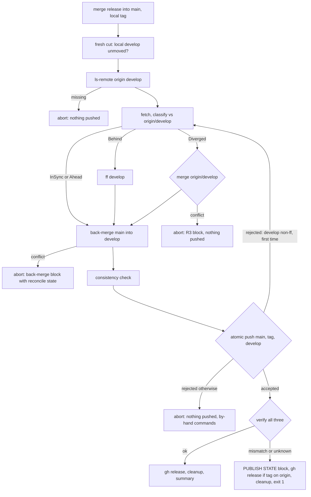

# Release Ceremony Develop Reconcile - Plan

## Goal Capsule

- **Objective:** `hex release cut` never strands a half-published release when `origin/develop` moves during the gate battery. It reconciles local `develop` with `origin/develop` before any push, publishes `main`, the tag, and `develop` in one atomic push, retries that push once after a fresh reconcile when origin moved again, and reports any remaining state with exact recovery commands.
- **Authority:** this plan's Requirements and KTDs govern. Repo standards bind every unit: `AGENTS.md` S6 (no quiet failures), `docs/testing-standard.md` (failing test commit before fix commit, prove by running code).
- **Stop conditions:** the reconcile cannot be expressed without a rebase or force (never allowed); the watcher's develop-sync divergence policy would have to change; origin rejects `--atomic` pushes in the live environment; a test in the Verification Contract cannot pass without weakening it.
- **Execution profile:** one branch `fix/release-develop-reconcile` in the hex-foundation worktree, a red test commit followed by a fix commit per behavior-changing unit, merged to `develop` locally with no PR.
- **Tail ownership:** the caller (LFG) owns simplify, review, and the local merge. The release that ships this fix is cut by the releaser as usual.

---

## Product Contract

### Summary

Change the cut ceremony in `system/harness/src/release.rs` so that, after the merge to `main` and the local tag, and before the back-merge, it checks that `origin/develop` exists, fetches it, and reconciles local `develop` with it (fast-forward when behind, a real merge when diverged, abort before any push on conflict). Replace the three sequential pushes with one atomic push of `main`, the tag, and `develop`, so origin either has all three or none. If that push is rejected because `origin/develop` moved again, reconcile once more and retry once. Report the only remaining uncertain state (an accepted push whose verification fails) as such, with what origin holds and what to run. Add tests that reproduce the incident with a bare origin fixture. Update the module docs and `docs/versioning.md`.

### Problem Frame

The ceremony pins `develop` at start, runs a battery of 30 to 60 minutes, then pushes `main` before `develop`. Its race guard compares the pinned SHA to the local `develop` ref only and never looks at origin. On 2026-09-16 another session pushed to `origin/develop` mid-battery; the ceremony pushed `main`, its develop push was rejected as non-fast-forward, and it aborted with the tag local-only, no GitHub release, and the release branch left on origin. Recovery took a hand merge, three pushes, a `gh release create`, and a branch delete (OBS-2026-09-16d).

### Requirements

**Reconcile before push**

- R1. After the merge to `main` and the local tag, and before the back-merge, the ceremony confirms `origin/develop` exists with `git ls-remote`, fetches it, and classifies local `develop` against the fetched `refs/remotes/origin/develop` with the existing `classify_develop_sync` classes.
- R2. `InSync` or `Ahead`: nothing changes. `Behind`: local `develop` is fast-forwarded to `origin/develop`. `Diverged`: `origin/develop` is merged into local `develop` with a no-fast-forward merge commit whose message names the release. Never a rebase, reset, or force.
- R3. A reconcile merge conflict aborts before any push after `git merge --abort`. The message states what is local-only (the `main` merge, the tag, and the release branch), that `develop` is unchanged, that nothing was pushed, and lists numbered by-hand recovery commands (below). It never tells the operator to re-run `--finish` while the local tag exists.
- R4. `RemoteMissing` (`git ls-remote origin develop` returns nothing) aborts before any push naming the missing branch; the ceremony never creates a base branch on origin. A network or authentication error during `ls-remote` or the fetch aborts with that error, never as `RemoteMissing`.
- R5. The phase summary carries a `develop-reconcile` line, printed as it happens: `in sync`, `local ahead by N (carried by the push)`, `fast-forwarded to <sha>`, or `merged N foreign commit(s): <short shas>`.
- R6. The existing local race guard (`check_pinned_unmoved` on `develop`, fresh cuts only) still runs before the reconcile. The reconcile itself runs on every cut mode (fresh, hotfix, finish).
- R6a. When the back-merge of `main` conflicts on a `develop` the reconcile moved, the existing back-merge conflict message reports the reconcile result in its state line (`develop at <sha>: fast-forwarded to origin` or `merged N foreign commit(s), unpushed`) instead of `develop is unchanged`.

**Atomic publish**

- R7. `main`, the tag, and `develop` are pushed in one `git push --atomic` with `HEX_RELEASE_PIPELINE=1`; origin accepts all three or none. Each ref is verified with `ls-remote` after the push.
- R8. A rejected atomic push leaves nothing on origin. When the rejection is a non-fast-forward on `develop`, the ceremony runs the reconcile once more and retries the atomic push once; a second rejection, or a rejection for any other reason, aborts with `Nothing was pushed` and the by-hand recovery commands.
- R9. An accepted push whose verification fails, or a push whose outcome is unknown (transport error after send), re-queries origin for all three refs and prints a `PUBLISH STATE` block naming each ref as `on origin at <sha>` or `not on origin`, then the GitHub release step runs only when the tag is on origin, cleanup runs, and the ceremony exits non-zero with the push command for any ref not on origin.
- R10. GitHub release creation and branch cleanup outcomes are captured independently and always both attempted after a successful publish; a failed GitHub release step keeps today's `Backfill with: gh release create ...` line in the summary.

**Tests and docs**

- R11. A test reproduces the incident: a foreign non-conflicting commit lands on `origin/develop` during the battery while local `develop` equals the pin; the reconcile classifies `Behind`, fast-forwards, the ceremony completes, `origin/develop` contains the foreign commit and the back-merge, and the tag is on origin. Against the pre-fix code this test fails with a rejected develop push after `main` was pushed.
- R12. A test with local `develop` one unpushed commit ahead of the pin plus a foreign non-conflicting commit classifies `Diverged`, creates the reconcile merge commit, and completes.
- R13. A test with local `develop` ahead and a foreign commit editing the same line asserts the reconcile conflict path: `Err`, `origin/main` unchanged, no tag on origin, local `develop` at its pre-cut SHA, message contains the R3 command block. A separate test with a foreign `version.txt` edit and no local-ahead commit asserts the back-merge conflict path with the R6a state line.
- R14. A test whose gate pushes a second foreign commit between the reconcile and the push (simulated with a pre-push hook that pushes from the second clone on the first attempt only) asserts the retry succeeds and origin ends with both foreign commits.
- R15. A test with a pre-push hook that rejects every push asserts nothing on origin, `Nothing was pushed`, and the by-hand commands; a test with a second clone that has no `develop` on origin asserts the R4 message before any push.
- R16. The module doc at the top of `release.rs` and `docs/versioning.md` describe the reconcile step, the atomic push, the single retry, and the `PUBLISH STATE` contract; the watcher's develop-sync policy text is unchanged.

### Key Decisions

- **Land by local merge, no pull request.** Governs how this plan ships. (session-settled: user-directed — chosen over opening a PR for review: Mike's explicit instruction for this pipeline; foundation develop autonomy already allows review-then-merge.)

### Scope Boundaries

- In scope: the cut ceremony's own develop handling, atomic publish with one retry, publish-state reporting, tests, docs.
- Out of scope: the oss-releaser watcher's develop-sync (its Diverged policy stays alert-only); reconciling `main` (main moving on origin during a cut is a different failure and today's hotfix guard aborts before any push); proving that local-ahead commits on `develop` are "legitimate" (the ceremony has always published local `develop`; the watcher's sync lag is the documented source).
- Interaction with the watcher: after an abort the lock releases and the watcher's next tick pushes `develop` when local is strictly ahead, or alerts when diverged. The abort messages say so in one line.

### Deferred to Follow-Up Work

- A `--resume` for the tail (GitHub release, cleanup) if an interruption between the accepted push and those steps ever happens in practice; today the summary's backfill line covers the GitHub release and cleanup is best-effort.
- Unify `cleanup_hint` with the inline recovery text in the back-merge conflict message.

---

## Planning Contract

### Key Technical Decisions

- KTD1. **Reconcile local `develop` with `origin/develop` before the back-merge, unconditionally.** The back-merge of `main` then lands on a `develop` that already contains origin's commits. Placement: after the guarded fresh-cut race check (R6) and outside its `!hotfix && finish.is_none()` conditional, before `git checkout develop && merge_no_ff(main)`. The fast-forward property holds at classification time; origin moving again afterward is handled by KTD4's retry, not assumed away.
- KTD2. **Reconcile order: ls-remote, fetch, classify against the fetched ref.** `ls_remote_sha(refs/heads/develop)` first (`None` is R4's abort; an error is a plain error). Then `git fetch --quiet origin develop` (objects plus `refs/remotes/origin/develop`, never a local branch write). Classify with `classify_develop_sync` from the local ref, the fetched remote-tracking ref (never a fresh `ls-remote` SHA whose objects may be absent), and `is_ancestor` both ways. `Behind`: `git merge --ff-only origin/develop` on `develop`. `Diverged`: `merge_no_ff` with message `reconcile: merge origin/develop into develop for <tag>`; on failure `git merge --abort` then bail with the R3 block. Extracted as `reconcile_develop_with_origin(repo_root, develop, tag) -> Result<DevelopReconcile>` with variants `InSync`, `Ahead(n)`, `FastForwarded(sha)`, `Merged(Vec<short shas>)`.
- KTD3. **One atomic push for `main`, the tag, and `develop`.** `git push --atomic origin main refs/tags/<tag> develop` with `HEX_RELEASE_PIPELINE=1` (the git-guard allows `main` under that env). Origin holds all three or none, so the two partial states the sequential order allowed (main without tag; main and tag without develop) cannot occur. Git 2.54 and a bare origin support `--atomic` (probed); GitHub does. A server that reports `does not support --atomic` is an abort before any push naming the stop condition. The `tag_push_action` idempotent-skip stays: when the tag is already on origin at the same SHA it is left out of the push list, and a divergent remote tag still refuses.
- KTD4. **One bounded retry on a develop non-fast-forward.** A rejected atomic push (git exit non-zero, no refs updated) whose stderr names `develop` as non-fast-forward triggers one more `reconcile_develop_with_origin` (which now sees `Behind` or `Diverged` again), then one more atomic push. Any other rejection, or a second rejection, aborts with `Nothing was pushed` plus the by-hand commands. The retry reuses the same function the recovery commands describe.
- KTD5. **Abort messages state machine state first, then numbered commands.** The R3 block (fresh cut and finish mode share it, since the local tag already exists in both):
  1. `git checkout develop && git merge --no-ff origin/develop   # resolve, commit`
  2. `git merge --no-ff main`
  3. `HEX_RELEASE_PIPELINE=1 git push --atomic origin main develop <tag>`
  4. `git branch -d <rel_branch>`
  Followed by the fresh-cut unwind alternative (`git tag -d <tag>`, `git branch -f main <main_before>`, `git branch -D <rel_branch>`, re-cut) and one line: `The releaser's develop-sync will push develop on its next tick if it is strictly ahead of origin, and alert if diverged.`
- KTD6. **Publish-state block only for verify-uncertain outcomes.** After an accepted push, `verify_pushed` for each of the three refs; on any mismatch or transport error, re-query all three with `ls-remote` and print `PUBLISH STATE` with per-ref `on origin at <sha>` / `not on origin`, then run the GitHub release step only if the tag is on origin, run cleanup, and exit non-zero with `HEX_RELEASE_PIPELINE=1 git push origin <missing refs>`. Never call `gh release create` when the tag is not on origin (it would mint a tag from the default branch).
- KTD7. **Tests move origin from a gate and from a pre-push hook.** The toy profile's gate is a shell command, so a test's gate pushes a commit from a `second_clone` to `origin/develop` during the battery (KTD1's race). The between-reconcile-and-push race uses a `core.hooksPath` pre-push hook in a test-owned hooks directory (not the fixture's shared `nohooks` dir) that pushes a foreign commit from the second clone on the first invocation and exits 0; the rejection tests use a hook that exits 1.

### High-Level Technical Design

### Assumptions

- Local-ahead commits on `develop` at cut time come from the watcher's develop-sync lag or finish mode; the ceremony publishes them as it always has. `Ahead` therefore needs no action and is reported in the phase line.
- `git fetch --quiet origin develop` updates `refs/remotes/origin/develop` in the fixtures (`gitflow_fixture` uses `git remote add`, which sets the default fetch refspec; `second_clone` is a clone).

### Sequencing

U1 (reconcile) then U2 (atomic publish, retry, publish state) then U3 (docs), each red test first.

---

## Implementation Units

### U1. Reconcile origin/develop before the back-merge

- **Goal:** the develop push can no longer be rejected because origin moved during the battery, and the two conflict paths report true state.
- **Requirements:** R1, R2, R3, R4, R5, R6, R6a, R11, R12, R13, R15 (RemoteMissing half). KTD1, KTD2, KTD5, KTD7.
- **Dependencies:** none.
- **Files:** `system/harness/src/release.rs` (ceremony step between the fresh-cut race guard and the back-merge; the back-merge conflict message; tests in `mod tests`).
- **Approach:**
  1. Add `reconcile_develop_with_origin` per KTD2 and call it unconditionally after the guarded race check.
  2. Foreign commits for the phase line: `git rev-list --abbrev-commit develop..origin/develop` before acting.
  3. Push the `develop-reconcile` phase and print it (R5).
  4. Thread the reconcile result into the back-merge conflict message's state line (R6a) and into the fresh-cut unwind text (`git branch -f develop origin/develop` drops an unpushed reconcile merge).
  5. Keep the later consistency check unchanged (`is_ancestor(main, develop)` still holds).
- **Execution note:** write the incident test first with a gate that pushes a foreign commit from a `second_clone`; confirm it fails against the unpatched ceremony with the rejected develop push after `main` is on origin. Then implement. The R13 reconcile-conflict test must fail against the unpatched code for the reason that the reconcile block is absent (the old code aborts in the back-merge message instead).
- **Patterns to follow:** `sync_develop_to_origin` (ls-remote, fetch, classify); `develop_sync_diverged_refuses_and_touches_nothing` for the second-clone push; the back-merge conflict `bail!` for message shape; `merge_no_ff`; `finish_fixture` and `cut_finish_completes_existing_release_branch` for finish mode.
- **Test scenarios:**
  - Incident (R11): local `develop` at the pin, gate pushes one foreign commit; ceremony `Ok`; phase line `fast-forwarded to <sha>`; no reconcile merge commit; `origin/develop` contains the foreign commit and the back-merge and descends from `main`; tag on origin.
  - Diverged (R12): one unpushed local commit on `develop` before the cut, gate pushes a foreign commit; phase line `merged 1 foreign commit`; a merge commit whose message names the tag exists on `develop`; ceremony `Ok`.
  - In sync: phase line `in sync`; no local branch changes from the fetch.
  - Ahead: local `develop` one commit ahead, origin unchanged; phase line `local ahead by 1`; ceremony completes and origin ends with that commit.
  - Reconcile conflict (R13): local-ahead commit and foreign commit edit the same line of `conflict.txt`; `Err`; message contains the KTD5 block and `Nothing was pushed`; `origin/main` unchanged; no tag on origin; local `develop` at its pre-cut SHA (merge aborted).
  - Back-merge conflict after a fast-forward (R13 second half): foreign commit edits `version.txt`; `Err`; message state line says `fast-forwarded to origin`; nothing on origin.
  - Origin has no `develop` branch (second clone deletes it): `Err` before any push naming `develop`; local branches untouched.
  - Finish mode (`finish_fixture`) with local `develop` one commit ahead of the pin: phase line `local ahead by 1`, ceremony completes, the push carries the commit.
  - Hotfix cut with a foreign commit on `origin/develop`: reconcile runs (phase line `fast-forwarded`), ceremony completes.
  - Local race guard still fires when a gate moves the local `develop` ref (existing test keeps passing).
- **Verification:** `cargo test -p hex-harness --lib release::tests` green with the new tests; the incident test is red on the pre-change file.

### U2. Atomic publish, one retry, publish-state reporting

- **Goal:** origin holds `main`, the tag, and `develop` together or not at all, and any uncertain outcome is named with its recovery.
- **Requirements:** R7, R8, R9, R10, R14, R15 (rejection half). KTD3, KTD4, KTD6, KTD7.
- **Dependencies:** U1.
- **Files:** `system/harness/src/release.rs` (push block, `tag_push_action` integration, phase summary; tests).
- **Approach:**
  1. Replace the three `push_ref` calls with one `push_atomic(repo_root, refspecs)` carrying `HEX_RELEASE_PIPELINE=1`; refspecs are `main`, `refs/tags/<tag>` (omitted when `tag_push_action` says already on origin), `develop`.
  2. Classify a non-zero exit: stderr containing `non-fast-forward` (or `fetch first`) for `develop` and no prior retry means run `reconcile_develop_with_origin` again and push again; otherwise bail with the KTD5 block (state: nothing pushed).
  3. On exit 0, `verify_pushed` for each ref; on any mismatch or transport error, build the `PUBLISH STATE` block per KTD6, run GitHub release only when the tag is on origin, run cleanup, bail with the block.
  4. Phase line on success: `push: main, <tag>, develop verified (atomic)`; with a retry: `push: ... verified (atomic, 1 retry after origin/develop moved)`.
  5. Capture the GitHub release and cleanup outcomes independently (already strings); both always run after an accepted push.
- **Execution note:** red first. The R14 race test uses a pre-push hook that, on its first run, pushes a foreign commit from the second clone (then removes its own marker file) and exits 0; against the old sequential code the develop push is rejected after `main` and the tag went out. The rejection test's hook exits 1 for every push; against the old code the tag is missing on origin while `main` is present.
- **Patterns to follow:** `push_ref` and `verify_pushed` for env and verify shape; `gh_release_step` backfill wording; `gitflow_fixture` hook-dir setup (use a fresh test-owned hooks dir).
- **Test scenarios:**
  - Happy path: phase summary `push` line reads `main, <tag>, develop verified (atomic)`; all three refs on origin at the expected SHAs.
  - Second race (R14): hook pushes a foreign commit on first attempt; ceremony `Ok`; phase line mentions `1 retry`; `origin/develop` contains both foreign commits and the back-merge.
  - Every push rejected (R15): `Err`; `main`, tag, and `develop` absent or unchanged on origin; message contains `Nothing was pushed` and the KTD5 commands.
  - Persistent non-fast-forward (hook pushes a foreign commit on every attempt): `Err` after exactly two pushes; nothing on origin; message names the second rejection.
  - Tag already on origin at the same SHA: push list omits the tag; ceremony completes (idempotent finish).
  - Verify-uncertain: simulate a verify mismatch by having a post-receive hook on the bare origin move `develop` after accepting; message contains `PUBLISH STATE`, `main` and tag `on origin`, `develop` `on origin at <other sha>`; GitHub release step ran (profile has it disabled, so `disabled by profile` in the summary); cleanup ran; result `Err`.
- **Verification:** `cargo test -p hex-harness --lib release::tests` green; `cargo fmt --all --check`; `cargo clippy -p hex-harness --all-targets --locked -- -D warnings` clean.

### U3. Docs

- **Goal:** the ceremony's written contract matches the code.
- **Requirements:** R16.
- **Dependencies:** U1, U2.
- **Files:** `system/harness/src/release.rs` (module doc header), `docs/versioning.md`.
- **Approach:**
  1. Module doc step list becomes: lock, preconditions, battery, version, branch, bump, notes, merge to main + tag, race guard (fresh cut), fetch + reconcile origin/develop, back-merge to develop, consistency check, atomic push (main, tag, develop) with one retry, verify, GitHub release, cleanup, summary.
  2. `docs/versioning.md` ceremony summary (steps 1 to 6) gains the reconcile step and the atomic push, plus a short "If a push is rejected" paragraph: nothing is on origin; the ceremony retried once after reconciling; the printed commands finish by hand.
  3. Leave the watcher develop-sync section unchanged.
- **Test scenarios:** `Test expectation: none -- documentation only; the Rust doc comment compiles; hex sanitize clean.`
- **Verification:** `hex sanitize` clean; docs consistent with the code.

---

## Verification Contract

| Gate | Command | Proves |
|---|---|---|
| Ceremony tests | `cargo test -p hex-harness --lib release::tests` (from `system/harness`) | U1, U2 scenarios plus existing 82 |
| Harness crate | `cargo test -p hex-harness` | no regressions |
| Format | `cargo fmt --all --check` | clean |
| Lint | `cargo clippy -p hex-harness --all-targets --locked -- -D warnings` | clean |
| Personalization | `hex sanitize` | clean |

Red-first proof: U1 and U2 each land as a `test(release): ...` commit whose new tests fail against the previous commit, followed by the `fix(release): ...` commit.

---

## Risks

- The reconcile merge runs inside the releaser's clone on the real `develop` branch. A conflict is aborted with `git merge --abort`, which leaves the tree as before the attempt; the R13 test asserts that.
- `--atomic` depends on the server. GitHub supports it; the fixture's bare repos do (probed with git 2.54). An unsupported server aborts before any push (stop condition), never falls back to sequential pushes.
- The fixture's toy profile has no docker or parity gates, so timing is not exercised; the gate-driven and hook-driven origin pushes stand in for "moved during the battery" and "moved between reconcile and push".
- Local-ahead commits on `develop` are published without proof of origin; unchanged from today and documented in Assumptions.
- An interruption (process killed) between the accepted push and the GitHub release or cleanup leaves the release published without its GitHub release entry; the next ceremony's idempotent tag skip and the backfill command cover it. A `--resume` is deferred.

---

## Definition of Done

- R1 to R16 met; all Verification Contract gates clean; each unit's red test commit precedes its fix commit.
- Branch merged to `develop` locally in the releaser's clone; no PR.
- The next ceremony the releaser runs prints the `develop-reconcile` and atomic `push` phase lines (observed after the release that ships this).
